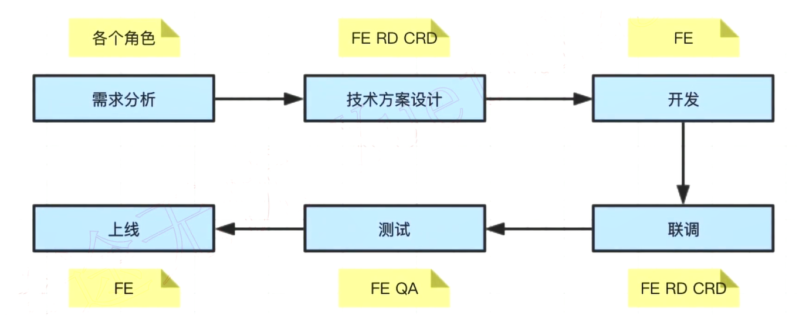

## html

- 如何理解 HTML 语义化?

  - 让人更容易读懂(增加代码可读性, 使用不同的标签元素)
  - 让搜索引擎更容易读懂(SEO)

- 块级元素和内联元素?
  - dispaly: block/table; 有 div,h1-h6, table ul ol p 等
  - display: inline/inline-block; 有 span img input button 等

## css

- 盒模型宽度计算

  - offsetWidth = (内容宽度 + 内边距 + 边框), 无外边距

- margin 纵向重叠问题

  - 相邻元素的 margin-top 和 margin-bottom 会发生重叠现象
  - 空白内容的标签也会重叠

- margin 负值问题

  - margin-top 和 margin-left 负值,元素向上/向左移动
  - margin-right 负值,右侧元素左移,自身不受影响
  - margin-bottom 负值,下方元素上移,自身不受影响

- BFC 理解与应用

  - Block format context, 块级格式化上下文
  - 一块独立渲染区域,内部元素的渲染不会影响边界以外的元素
  - 形成 BFC 的常见条件

    - floct 不是 none
    - pasition 是 absolute 或 fixed
    - overflow 不是 visible
    - display 是 flex inline-block 等

  - 应用
    - 清除浮动

- float 布局
  - 圣杯布局和双飞翼布局的目的
    - 三栏布局,中间一栏最先加载和渲染(内容最重要)
    - 两侧内容固定, 中间内容随着宽度自适应
- 圣杯布局和双飞翼布局的技术总结

  - 使用 float 布局
  - 两侧使用 margin 负值,以便和中间内容横向重叠
  - 防止中间内容
    被两侧覆盖, 需要留白,一个用 padding(圣杯 + 定位) 一个用 margin(双飞翼)

- flex 布局
  - 常用语法
    - flex-direction
    - flex-wrap
    - justify-content
    - align-self
    - align-items
- absolute 和 relative 定位

  - relative 依据自身定位
  - absolute 依据最近一层的定位元素定位

- 水平居中

  - inline 元素: text-align: center;
  - block 元素: margin: auto;
  - absolute 元素: left:50%;margin-left 负值

- 垂直居中

  - inline 元素: line-height 的值等于 height 值
  - absolute 元素: top:50% + margin-top 负值
  - absolute 元素: transform(-50%, -50%)
  - absulute 元素: top,left,bottom,right =0 + margin: auto

- 网页视口尺寸
  - window.screen.height // 屏幕高度
  - window.innerHeight // 网页视口高度
  - document.body.clientHeight // body 高度

## js

- 除了 == null 之外, 其他一律用 ===

### 原型关系

- 每个 class 都有显示原型 prototype
- 每个实例都有隐式原型**proto**
- 实例的**proto**指向对应的 class 的 prototype

> 所有的自由变量的查找,是在函数定义的地方,向上级作用域查找,不是在执行的地方!

- 将参数拆解为数组
  - const args = Array.prototype.slice.call(arguments)

### promise 三种状态

- pendding
- resolved
- rejected

- async 修饰的函数返回值为 promise 对象

  ```javascript
  async function fn1() {
    // return 100;  // 相当于 return Promise.resolve(100)
    return Promise.resolve(200);
  }

  // 如 await 后面是一个Promise, 相当于 Promise then
  // const res = await 100   // res => 100 不是Promise
  // 也可以理解为 await Promise.resolve(100)
  ```

> 总结: 只要不出错, 返回的是 resolved, 只要报错, 返回 rejected
> resolved 触发 then, rejected 触发 catch

> 注: 自执行函数之前加!或; async 和 await 使用 try...catch 捕获

### 异步的本质

- async/await 是消灭异步回调的终极武器
- JS 还是单线程, 还行是有异步, 还得基于 event loop

### for...of

- for...of 常用于异步的遍历

### 宏任务和微任务

- 宏任务: setTimeout, setInterval, Ajax,DOM 事件
- 微任务: Promise async/await
- 微任务执行时机要比宏任务早

### 为什么微任务执行时机要比宏任务早?

- event loop 和 DOM 渲染
  - 每次 Call Stack 清空(即每次轮询结束),即同步任务执行完
  - 都是 DOM 重新渲染的机会, DOM 结构如有改变则重新渲染
  - 然后再去触发下一次 Event Loop

> 微任务: DOM 渲染前触发
> 宏任务: DOM 渲染后触发
> 微任务是 ES6 语法规定的
> 宏任务是由浏览器规定的

### property 和 attribute

- property: 修改对象属性, 不会体现到 html 结构中(建议使用)
- attribute: 修改 html 属性,会改变 html 结构
- 两者都有可能引起 DOM 重新渲染

### 优化 DOM 操作的性能

- DOM 查询做缓存
- 将频繁操作改为一次性操作(使用文档片段: createDocumentFragment)

### BOM 操作

- navigator
  - const ua = navigator.userAgent
- screen
- location
- history

### ajax 的核心 API

- XMLHttpRequest

  ```js
  // get请求
  const xhr = new XMLHttpRequest();
  xhr.open("GET", "/api", true); // true开启 异步
  xhr.onreadystatechange = function () {
    // 这里的函数异步执行
    if (xhr.readyState === 4) {
      if (xhr.status === 200) {
        alert(xhr.responseText);
      }
    }
  };
  xhr.send(null);

  // post请求
  const xhr = new XMLHttpRequest();
  xhr.open("GET", "/login", true); // true开启 异步
  xhr.onreadystatechange = function () {
    // 这里的函数异步执行
    if (xhr.readyState === 4) {
      if (xhr.status === 200) {
        alert(xhr.responseText);
      }
    }
  };
  const postData = {
    userName: "zhangsan",
    password: "xxx",
  };
  xhr.send(JSON.stringify(postData));
  ```

  - xhr.readyState
    - 0 - (未初始化)还没有调用 send()方法
    - 1 - (载入)已调用 send()方法,正在发送请求
    - 2 - (载入完成) send()方法执行完成,已经接收到全部的响应内容
    - 3 - (交互) 正在解析响应内容
    - 4 - (完成) 响应内容解析完成, 可以在客户端调用

- 状态码 -跨域: 同源策略, 跨域解决方案

### cookie 的缺点

- 存储大小, 最大 4kb
- http 请求时需要发送到服务端,增加请求数据量
- 只能用 cocument.cookie = '...' 来修改, 过于简陋

### localStorage 和 sessioniStorage

- HTML5 专门为存储而设计, 最大可存 5M
- API 简单易用 setTtem getItem
- 不会随着 http 请求被发送出去

- localStorage 数据会永久存储,除非代码或手动清除
- sessioniStorage 数据只存在于当前会话, 浏览器关闭会清空
- 一般用 localStorage 会更多一些

### 状态码分类

- 1xx 服务器收到请求
- 2xx 请求成功
  - 200 成功
- 3xx 重定向
  - 301 永久重定向(配合 location,浏览器自动处理)
  - 302 临时重定向(配合 location,浏览器自动处理)
  - 304 资源未被修改
- 4xx 客户端错误
  - 404 资源未找到
  - 403 没有权限
- 5xx 服务器错误
  - 500 服务器错误
  - 504 网关超时

### http methods

- 传统的 methods
  - get 获取
  - post 发送
- 现在的 methods
  - get 获取数据
  - post 新建数据
  - patch/put 更新数据
  - delete 删除数据
- Restful API
  - 一种新的 API 设计方法(早已推广使用)
  - 传统 API 设计: 把每个 url 当做一个功能
  - Restful API 设计: 把每个 url 当做一个唯一的资源
    - 如何设计成一个资源?
      - 尽量不用 url 参数
      - 用 method 表示操作类型

### http 常见的 header

- 常见的 Request Headers
  - Accept 浏览器可接收的数据格式
  - Accept-Encoding 浏览器可接收的压缩算法, 如 gzip
  - Accept-Language 浏览器可接收的语言
  - Connection: keep-alive 一次 TCP 连接重复使用
  - cookie
  - Host
  - User-Agent(简称 UA) 浏览器信息
- 常见的 Response Headers
  - Content-type 发送数据的格式, 如 application/json
  - Content-length 返回数据的大小, 多少字节
  - Content-Encoding 返回数据的压缩算法
  - Set-Cookie
  - Cache-Control
  - Last-Modified

### http 缓存

- 强制缓存
- 协商缓存(\*)
  - 服务端和客户端通过标识判断要不要重新向客户端发送资源

### 常用的 git 命令

- git add \* 添加
- git checkout xxx 还原
- git commit -m "xxx" 提交
- git push origin master 推送 master 是分支名
- git pull origin master 拉取
- git branch 查看分支
- git switch 切换分支
- git checkout -b 新建/切换分支
- git merge xxx 合并分支
- git status 检查是否有修改
- git diff xxx 对比
- git log 日志 有 id
- git show + id 查看提交的内容
- git fetch 把当前的所有分类拉取下来
- git stash 存储当前分支下的所有改动
- git stash pop 取出存储当前分支下的所有改动

### 移动端抓包

- 工具 Charles

### linux 命令

- ls 查看文件夹及文件(平铺)
  - ls -a 查看所有(隐藏的)
- ll 查看文件夹及文件(列表)
- mkdir a 创建 a 文件夹
- rm -rf a 删除文件夹/rm 文件名
- mv a.txt b.txt 修改文件名 如果 b.txt 位置是路径则是移动文件
- cp a.js a1.js 拷贝
- vi d.js 编辑 点击 i 激活编辑 esc 关闭激活编辑状态 :wq 保存并退出
- vim d.js
- cat d.js 查看 head d.js 查看前几行内容 tail d.js 查看末尾几行
- grep "babel" package.json 根据关键词查看内容

### 渲染过程

- 根据 HTML 代码生成 dom tree
- 根据 CSS 代码生成 CSSOM
- 将 DOM Tree 和 CSSOM 整合形成 Render Tree
- 根据 Render Tree 渲染页面
- 遇到 script 标签则暂停渲染,优先加载并执行 js 代码,完成再继续
- 直到把 Render Tree 渲染完成

### window.onload 和 DOMContentLoaded

```js
window.addEventListener("load", function () {
  // 页面的全部资源加载完成才会执行, 包括图片/视频等
});
window.addEventListener("DOMContentLoaded", function () {
  // DOM 渲染完即可执行, 此时图片/视频还可能没有加载完
});
```

### 性能优化

#### 性能优化原则

- 多使用内存 缓存或其他方法
- 减少 CPU 计算量, 减少网络加载耗时
- (适用于所有编程的性能优化 --- 空间换时间)

##### 让加载更快

- 减少资源体积: 压缩代码
- 减少访问次数: 合并代码,SSR 服务端渲染,缓存
- 使用更快的网络: CDN 分发

##### 让渲染更快

- CSS 放在 head, js 放在 body 最下面
- 尽早开始执行 js, 用 DOMContentLoaded 触发
- 懒加载(图片/路由)
- 对 DOM 查询进行缓存
- 频繁 DOM 操作,合并到一起插入 DOM 结构
- 节流/防抖

#### 防抖 debounce

监听一个输入框, 文字变化后触发 change 事件

```js
// 防抖
function debounce(fn, delay = 500) {
  // timer 是闭包中的
  let timer = null;

  return function () {
    if (timer) {
      clearTimeout(timer);
    }
    timer = setTimeout(() => {
      fn.apply(this, arguments);
      timer = null;
    }, delay);
  };
}
```

#### 节流 throttle

获取元素拖拽位置

```js
// 节流
function throttle(fn, delay = 100) {
  let timer = null;

  return function () {
    if (timer) {
      return;
    }
    timer = setTimeout(() => {
      fn.apply(this, arguments);
      timer = null;
    }, delay);
  };
}
```

### 手写 call/bind/apply

```js
// call
Funcution.prototype.customCall = function (context, ...args) {
  if (context == null) {
    context = globalThis;
  }
  if (typeof context !== "object") {
    context = new Object(context); // 值类型, 变为对象
  }
  const fnKey = Symbol(); // 不会出现属性名称的覆盖
  context[fnKey] = this; // this 就是当前的函数

  const res = context[fnKey](...args); // 绑定了this

  delete context[fnKey];

  return res;
};

// bind
Function.prototype.customBind = function (context, ...bindArgs) {
  // context 是 bind传入的this
  // bindArgs 是 bind传入的各个参数
  const self = this; // 当前的函数本身

  return function (...args) {
    // 拼接参数
    const newArgs = bindArgs.concat(args);
    return self.apply(context, newArgs);
  };
};

// apply
Function.prototype.customApply = function (context, args) {
  if (context == null) {
    context = globalThis;
  }
  if (typeof context !== "object") {
    context = new Object(context); // 值类型, 变为对象
  }

  const fnKey = Symbol(); // 不会出现属性名称的覆盖
  context[fnKey] = this; // this 就是当前的函数

  const res = context[fnKey](...args); // 绑定了 this

  delete context[fnKey]; // 清理掉 fn 防止污染

  return res;
};
```

### 安全

- xss 跨站请求攻击
  - 替换特殊字符
- xsrf 跨站请求伪造

### 数组的 pop push unshift shift 分别是什么?

- pop
  - 功能: 抛出数组最后一个元素
  - 返回值: 数组最后一个元素
  - 是否会对原数组造成影响: 是
- shift
  - 功能: 抛出数组第一个元素
  - 返回值: 数组第一个元素
  - 是否会对原数组造成影响:
- push
  - 功能: 从数组后面追加元素
  - 返回值: 数组长度
  - 是否会对原数组造成影响: 是
- unshift
  - 功能: 从数组前面追加元素
  - 返回值: 数组长度
  - 是否会对原数组造成影响: 是

### 数组纯函数

- concat
- map
- filter
- slice

### ajax 请求 get 和 post 的区别

- get 一般用于查询操作,post 一般用于提交操作
- get 参数拼接在 url 上, post 放在请求体内
- 安全性: post 易于防止 csrf, 安全性高

### new 操作符具体干了什么呢?

- 创建一个空对象，并且 `this` 变量引用该对象，同时还继承了该函数的原型
- 属性和方法被加入到 `this` 引用的对象中
- 新创建的对象由 `this` 所引用，并且最后隐式的返回 `this`

### new Object()和 Object.create()区别

- {}等同于 new Object(),原型 Object.prototype
- Object.create(null) 没有原型

## 完整项目流程



## 需求分析

- 了解背景
- 质疑需求是否合理
- 需求是否闭环
- 开发难度如何
- 是否需要其他支持
- 不要急于给排期

### 技术方案设计

- 求简, 不过渡设计
- 产出文档
- 找准设计重点
- 组内评审
- 和 RD CRD 沟通
- 发出会议结论

### 开发

- 如何反馈排期
- 符合开发规范
- 写出开发文档
- 及时单元测试
- Mock API
- Code Review

### 联调

- RD CRD 技术联调
- 让 UE 确定视觉效果
- 让 PM 确定产品功能

### PM 加需求怎么办?

- 不能拒绝, 走需求变更流程即可
- 如果公司有规定,则按规定走
- 否则,发起项目组和 leader 的评审,重新评估排期

### 测试

- 提测发邮件,抄送项目组
- 测试问题要详细记录
- 有问题及时沟通

### 上线

- 上线之后及时通知 QA 回归测试
- 上线之后及时同步给 PM 和项目组
- 如有问题,及时回滚. 先止损,再排查问题

### Array 和 Set 区别

- array 是有序结构, set 是无序结构

### Object 和 Map 的区别

- Object 的 key 设置有限制, Map 的 key 可以是任何值
- Object 是无序结构, Map 是有序结构

# 链表 VS 数组

- 都是有序结构

- 链表: 查询慢 O(n), 新增和删除快 O(1)

- 数组: 查询快 O(1), 新增和删除慢 O(n)

- > 分析
  >
  > - 数组是连续存储,push 很快,shift 很慢
  > - 链表是非连续存储, add 和 delete 都很快(但查找很慢)
  > - 结论: 链表实现队列更快
