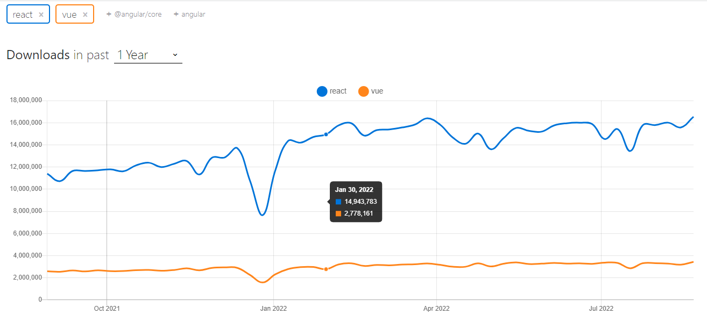

## Vue、React、TS的发展历史

大家好，本小节将了解一下三大热门技术的发展历程，从而更好的去学习和掌握它们。首先先来聊一聊React框架。

React是用于构建用户界面的JavaScript库， 起源于Facebook公司的内部项目，该公司对市场上所有 JavaScript MVC框架都不满意，于是决定自行开发一套，用于架设Instagram网站。并于2013年5月开源React框架。

在发布React0.1.0版本后，一直处于非稳定的阶段，通过几年不断的发展，React也越来越成熟，是时候给业界一个明确的态度，所以在2016年4月，React发布了React15.0.0，从React0.14.0直接跳到了React15.0.0这样一个大版本。从而标志着React框架可以用于商业项目开发中。

2017年9月，React16.0.0发布， 提供了新的虚拟DOM引擎，即fiber引擎，可以使虚拟DOM进行增量式渲染，简单来说就是性能更好了，体验更好了。 

之后React16.8.0横空出世，带来了全新编程体验 Hooks，即函数式组件，彻底改变了React未来的开发趋势，也让编写React代码变得简单（之前只有类组件开发，学习成本比较高）。

2020年10月，React17.0.0版本发布，全新的JSX解析方式和合成事件处理方案，让React操作起来更加简约和BUG修复等。

2022年3月，React18.0.0版本发布，这个版本也是我们这套课程所采用的版本，在17的基础上又对底层做了很多优化，引入并发模式，新的use函数，新的API写法，Suspense与transition，自动批量处理等内容，那么这些新的功能都会在课程中有被讲解到。 

React框架的历史我们就先介绍到这里，下面一起来了解一下Vue框架的发展历程吧。

2013年，在Google工作的尤雨溪，受到Angular框架的启发，开发了一款轻量级框架，最初命名为Seed。2013年12月，更名为Vue，图标颜色是代表生机勃勃的绿色。

2015年10月，Vue1.0.0发布，是Vue历史上的第一个里程碑。同年，vue-router、vuex、vue-cli相继发布，标志着Vue从一个视图层库发展为一个渐进式框架。

2016年10月，Vue2.0.0发布，是Vue的第二个重要里程碑，它吸收了React的虚拟DOM方案，还支持了服务端渲染，一跃成为了前端圈中最热门的框架之一。

2020年9月，Vue发布了3.0版本，源码完全采用TypeScript编写，对TS支持更好。除了对TS高度支持外，还增加了Composition API可以编写更复杂的应用程序。还有对性能、加载速度、内存占用等都得到了明显的提升。本课程将全面围绕Vue3进行讲解，将全面介绍3中的核心特性和周边生态。

说一下两款框架的目前现状，从热度对比看的话，全球趋势肯定是React使用的多一些，毕竟是大公司研发的，有保障，有排面。但在国内的话，其实Vue和React是不相上下的，基本上是两足鼎立的趋势，毕竟Vue使用起来更简单，且中文社区也比较好，下面是[npmtrends](https://npmtrends.com/react-vs-vue)的数据对比。

    
    
React vs Vue

最后呢，一起来了解一下TypeScript的发展历史，TS最早可追溯到2010年，在微软公司内部进行使用，直到2013年6月，经历了一个预览版之后微软正式发布了正式版TypeScript。

2014年4月，TS1.0.0正式上线。随后的多年发展中不断的进行升级，如：2016年9月，发布TS2.0.0，2018年6月，发布TS3.0.0，2020年8月，发布TS4.0.0。

在这些大版本发布的过程中，并没有太大革命性的改进，基本上都是不断的优化与升级中，这也是TypeScript本身语言特点导致的，因为知识点比较零散，语法之间并没有太多联系，所以基本可以从TS4开始使用就可以了，不用太关心之前版本的情况。

TypeScript已经成为目前前端开发中首选的语言之一，且TS团队已经向ECMA组织发出修改意见，希望JS中能够支持静态类型检查，并且已经到了提案的阶段。所以未来的趋势就是JS越来越趋近于TS，使得TS的影响力将继续扩大。

目前在一线公司和一些高级团队中都开始采用Vue+TS 或 React+TS的开发形式，也慢慢成为了未来的趋势。作为前端开发人员三大热门技术就是以后的必备技能，所以这也是为什么打造这样一门轻松、系统、高效、贯通的前端课程，就是让大家能够在最短的时间内快速上手三大热门技术，并能够应对现在与未来。

