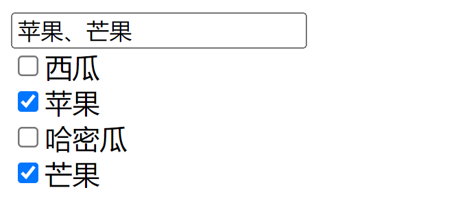

## 测试题（实操）

完成以下练习题，示例如下：

<div align=center>
    
    <div>复选项选择测试题</div>
</div>

要求如下：

1. 输入框中内容根据顿号进行分割
2. 复选项选中添加水果名称到输入框中
3. 复选框取消选中从输入框中删除水果名称
4. 输入框可直接输入内容来联动复选框

参考答案：

```html
<div id="app">
    <input type="text" v-model="fruitsInput"><br>
    <input type="checkbox" v-model="fruits" value="西瓜">西瓜<br>
    <input type="checkbox" v-model="fruits" value="苹果">苹果<br>
    <input type="checkbox" v-model="fruits" value="哈密瓜">哈密瓜<br>
    <input type="checkbox" v-model="fruits" value="芒果">芒果<br>
</div>
<script>
    let vm = Vue.createApp({
        data() {
            return {
                fruits: ['苹果', '芒果']
            }
        },
        computed: {
            fruitsInput: {
                set(val){
                    this.fruits = val.split('、');
                },
                get(){
                    return this.fruits.join('、');
                }
            }
        }
    }).mount("#app")
</script>
```