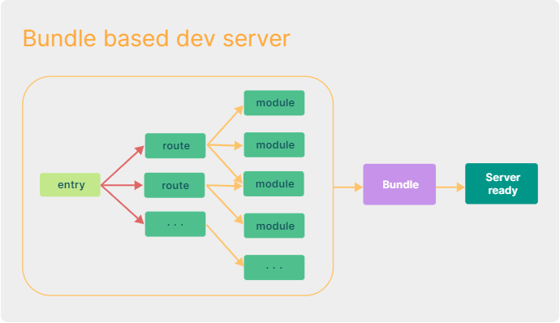
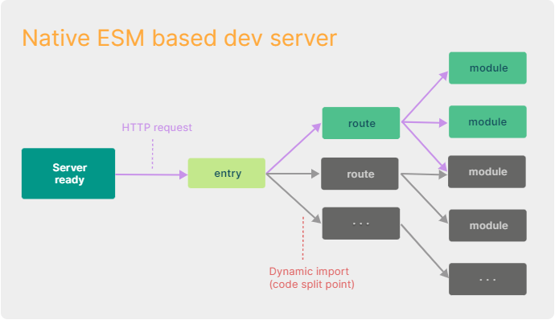
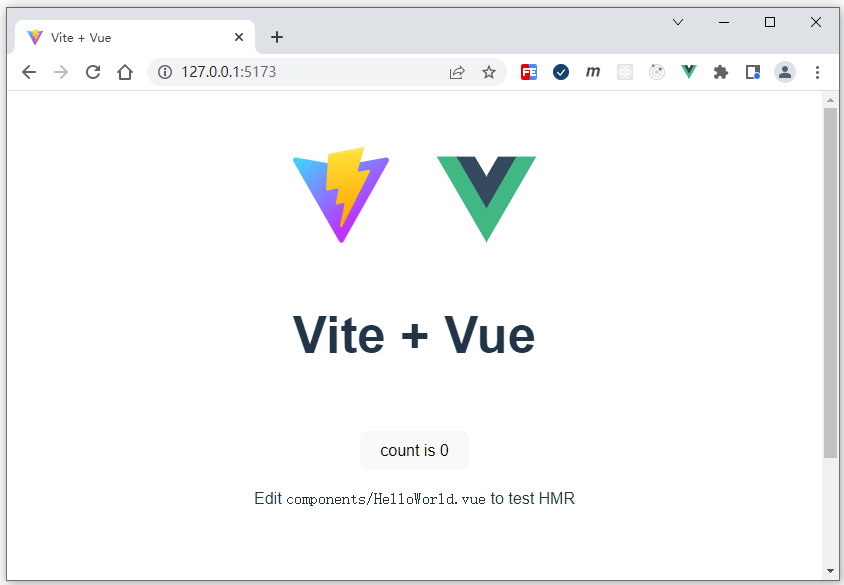

# Vite3介绍及基本使用

## 什么是Vite

Vite是下一代的前端工具链，即Vue新的项目脚手架，跟Vue CLI功能类似，只不过底层实现的机制不同，官方更推荐在项目开发中使用Vite来替换Vue CLI，因为Vite启动速度更快，不过Vite目前还不算稳定，升级速度较快，2022年7月，Vite发布3.0版本。

## Vite与Vue CLI的区别

Vue CLI底层是基于Webpack工具实现的，前面也已经介绍过了，并实现了一个基于webpack的简易脚手架。那么Vite是一个轻量级的、速度极快的构建工具，基于浏览器原生ESM的能力，它省略了开发环境的打包过程，利用浏览器去解析imports，在服务端按需编译返回，下面通过图示对比两个脚手架的底层区别。

<div align=center>
    
    <div>Vue-CLI底层原理</div>
</div>

<div align=center>
    
    <div>Vite底层原理</div>
</div>

通过图示可以发现，在开发中Vite没有打包的过程，所以启动速度和编译速度都是很快的。Vue-CLI这种需要打包文件到一起的方式也并不是一无是处，打包器支持了动态模块热替换（HMR）：允许一个模块 “热替换” 它自己，而不会影响页面其余部分，这大大改进了开发体验。

## Vite脚手架的基本使用

1. 安装脚手架

   ```she
   # npm 6.x
   npm create vite@latest vite-study
   # yarn
   yarn create vite vite-study
   # pnpm
   pnpm create vite vite-study
   ```

2. 选择框架：因为Vite可以和很多框架配合使用，所以这里我们选择：Vite + Vue

   ```she
   ? Select a framework: » - Use arrow-keys. Return to submit.
       Vanilla
   >   Vue
       React
       Preact
       Lit
       Svelte
   ```

3. 选择变体：这里先选择默认的JavaScript形式，后面章节会通过视频的方式来演示自定义形式

   ```shell
   ? Select a variant: » - Use arrow-keys. Return to submit.
   >   JavaScript
       TypeScript
       Customize with create-vue
       Nuxt
   ```

4. 进入项目：安装第三方模块，并启动项目

   ```she
   cd vite-study
   npm install
   npm run dev
   
   VITE v3.1.0  ready in 408 ms
   
     ➜  Local:   http://127.0.0.1:5173/
     ➜  Network: use --host to expose
   ```

<div align=center>
    
    <div>Vue+Vite启动界面</div>
</div>
## 目录结构

Vite的目录结构与Vue CLI的目录结构基本相同，甚至比Vue CLI还要简单，打开根目录下的`index.html`页面，代码如下：

```html
<!DOCTYPE html>
<html lang="en">
  <head>
    <meta charset="UTF-8" />
    <link rel="icon" type="image/svg+xml" href="/vite.svg" />
    <meta name="viewport" content="width=device-width, initial-scale=1.0" />
    <title>Vite + Vue</title>
  </head>
  <body>
    <div id="app"></div>
    <script type="module" src="/src/main.js"></script>
  </body>
</html>
```

其中`<script type="module" src="/src/main.js"></script>`这句直接采用原生ESM的方式进行使用，避免了文件合并打包的处理，运行速度有了明显的提升。关于更多内容，会在后续章节中进行讲解。

