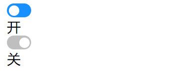

## 测试题（实操）

完成以下练习题，示例如下：

<div align=center>
    
    <div>el-switch开关组件测试题</div>
</div>

要求如下：

1. 根据给定的结构完成组件的编写
2. 可以点击切换组件的状态

```html
<style>
.switch {
  width: 28px;
  height: 16px;
  border-radius: 100px;
  background: #1890ff;
  cursor: pointer;
}
.switch--closed {
  background: rgba(0, 0, 0, 0.25);
}
.switch--closed .switch__handle {
  left: 14px;
}
.switch__handle {
  width: 12px;
  height: 12px;
  background: white;
  border-radius: 50%;
  position: relative;
  left: 2px;
  top: 2px;
  transition: .2s;
}
</style>
<div id="app">
  <el-switch v-model="value1"></el-switch>{{ value1 ? '开' : '关' }}
  <br>
  <el-switch v-model="value2"></el-switch>{{ value2 ? '开' : '关' }}
</div>
<script>
  let ElSwitch = {
    //代码编写区域
  }; 
  let vm = Vue.createApp({
    data() {
      return {
        value1: true,
        value2: false
      }
    },
    components: {
      ElSwitch
    }
  }).mount('#app');
</script>
```

参考答案：

```javascript
let ElSwitch = {
  props: ['modelValue'],
  emits: ['update:modelValue'],
  computed: {
    switchClass(){
      return {
        'switch': true,
        'switch--closed': !this.modelValue
      }
    }
  },
  template: `
    <div :class="switchClass" @click="$emit('update:modelValue', !modelValue)">
      <div class="switch__handle"></div>
    </div>
  `
};
```