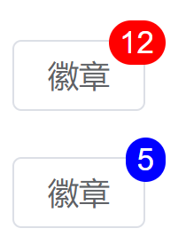

完成以下练习题，示例如下：

<div align=center>
    
    <div>el-badge徽章组件测试题</div>
</div>

要求如下：

1. 根据给定的结构完成组件的编写
2. 要求组件采用组合式API来完成
3. 父子通信属性：value默认值0、type默认值danger 

```html
<template>
  <el-badge :value="12">徽章</el-badge>
  <el-badge :value="5" type="primary">徽章</el-badge>
</template>
```

参考答案：

```vue
<template>
  <button class="el-badge">
    <slot></slot>
    <span :class="'el-badge-num el-badge-'+type">{{ value }}</span>
  </button>
</template>
<script setup>
  import { defineProps } from 'vue'
  defineProps({
    value: {
      type: Number,
      default: 0
    },
    type: {
      type: String,
      default: 'danger'
    }
  });
</script>
<style lang="scss" scoped>
  .el-badge{
    display: inline-flex;
    justify-content: center;
    align-items: center;
    line-height: 1;
    height: 32px;
    white-space: nowrap;
    cursor: pointer;
    background-color: #ffffff;
    border: 1px solid #dcdfe6;
    border-color: #dcdfe6;;
    color: #606266;
    -webkit-appearance: none;
    text-align: center;
    box-sizing: border-box;
    outline: none;
    transition: .1s;
    font-weight: 500;
    user-select: none;
    vertical-align: middle;
    padding: 8px 15px;
    font-size: 14px;
    border-radius: 4px;
    position: relative;
  }
  .el-badge-num{
    position: absolute;
    right: -10px;
    top: -10px;
    color: white;
    border-radius: 10px;
    padding: 3px 5px;
  }
  .el-badge-primary{
    background: blue;
  }
  .el-badge-danger{
    background: red;
  }
  </style>
```
  