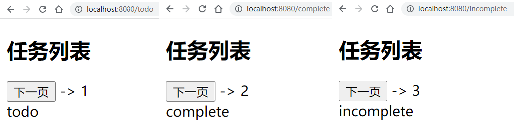

完成以下练习题，示例如下：

<div align=center>
    
    <div>实操练习题</div>
</div>

要求如下：

1. 数字为共享状态 state.page，默认值为0 
2. 点击下一页可以切换不同的路由
3. 进入对应的路由，可修改state.page值 

```vue
// App.vue
<template>
  <h2>任务列表</h2>
  <div>
    <button @click="handleNextPage">下一页</button> -> {{ page }}
  </div>
  <router-view></router-view>
</template>
```

参考答案：

```vue
//App.vue
<script setup>
  import { computed } from 'vue';
  import { useStore } from 'vuex';
  import { useRouter } from 'vue-router';
  let urls = ['/todo', '/complete', 'incomplete'];
  let store = useStore();
  let router = useRouter();
  let page = computed(() => store.state.page);
  let handleNextPage = () => {
    urls[page.value] && router.push(urls[page.value]);
  }
</script>

//Todo.vue
<script setup>
import { defineComponent } from 'vue';
import { useStore } from 'vuex';
defineComponent({
  name: 'TodoView'
});
let store = useStore();
store.commit('next', 1);
</script>

//Complete.vue 
<script setup>
import { defineComponent } from 'vue';
import { useStore } from 'vuex';
defineComponent({
  name: 'CompleteView'
});
let store = useStore();
store.commit('next', 2);
</script>

//Incomplete.vue
<script setup>
import { defineComponent } from 'vue';
import { useStore } from 'vuex';
defineComponent({
  name: 'IncompleteView'
});
let store = useStore();
store.commit('next', 3);
</script>

//index.js
<script>
const store = createStore({
  state: {
    page: 0
  },
  mutations: {
    next(state, payload){
      state.page = payload;
    }
  }
});
</script>
```
  