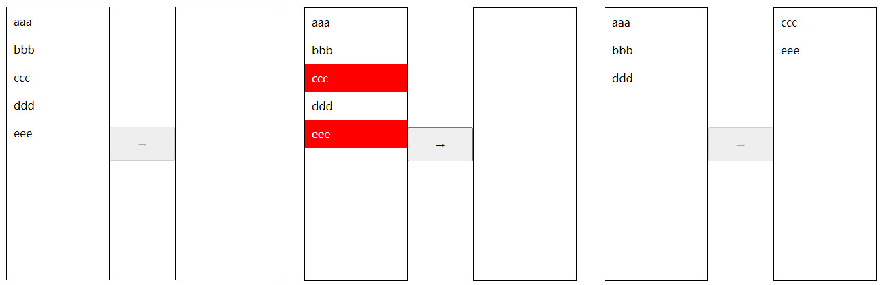

## 测试题（实操）

完成以下练习题，示例如下：

<div align=center>
    
    <div>穿梭框测试题</div>
</div>

初始代码如下：

```html
<!DOCTYPE html>
<html lang="en">
<head>
  <meta charset="UTF-8">
  <meta http-equiv="X-UA-Compatible" content="IE=edge">
  <meta name="viewport" content="width=device-width, initial-scale=1.0">
  <title>Document</title>
  <style>
    *{margin: 0; padding: 0;}
    li{ list-style: none;}
    .transfer{ display: flex; align-items: center; width:400px; margin: 20px auto;}
    .transfer ul{ width: 150px; height: 400px; border:1px black solid;}
    .transfer button{ height: 50px; flex-grow: 1;}
  </style>
  <script src="../react.development.js"></script>
  <script src="../react-dom.development.js"></script>
  <script src="../babel.min.js"></script>
  <script src="../lodash.min.js"></script>
</head>
<body>
  <div id="app"></div>
  <script type="text/babel">
    let app = document.querySelector('#app');
    let root = ReactDOM.createRoot(app);
    class Transfer extends React.PureComponent {
      state = {
        leftList: [
          {id: 1, isActive: false, text: 'aaa'},
          {id: 2, isActive: false, text: 'bbb'},
          {id: 3, isActive: false, text: 'ccc'},
          {id: 4, isActive: false, text: 'ddd'},
          {id: 5, isActive: false, text: 'eee'}
        ],
        rightList: [],
        disabled: true
      }
      render(){
        return (
          <div className="transfer">
            <ul className="left">
            </ul>
            <button disabled={this.state.disabled}>→</button>
            <ul className="right">
            </ul>
          </div>
        );
      }
    }
    let element = (
      <Transfer />
    );
    root.render(element)
  </script>
</body>
</html>
```

要求如下：

1. 左侧列表可以选中列表项，也可以取消列表项
2. 当有至少一个列表项被选中后，按钮可以点击
3. 点击后，右侧新增列表项，左侧减少列表项

参考答案：

```html
<script type="text/babel">
    let app = document.querySelector('#app');
    let root = ReactDOM.createRoot(app);
    class Transfer extends React.PureComponent {
      state = {
        leftList: [
          {id: 1, isActive: false, text: 'aaa'},
          {id: 2, isActive: false, text: 'bbb'},
          {id: 3, isActive: false, text: 'ccc'},
          {id: 4, isActive: false, text: 'ddd'},
          {id: 5, isActive: false, text: 'eee'}
        ],
        rightList: [],
        disabled: true
      }
      componentDidUpdate = () => {
        this.disabledButton();
      }
      handleClick = (index) => {
        return () => {
          let leftList = _.cloneDeep(this.state.leftList)
          leftList[index].isActive = !leftList[index].isActive;
          this.setState({
            leftList
          })
        }
      }
      handleAddRight = () => {
        let leftList = _.cloneDeep(this.state.leftList)
        let lefts = leftList.filter((v)=> !v.isActive)
        let rights = leftList.filter((v)=> v.isActive)
        this.setState({
          leftList: lefts,
          rightList: [...this.state.rightList, ...rights]
        })
      }
      disabledButton = () => {
        let ret = this.state.leftList.some((v)=> v.isActive)
        this.setState({
          disabled: !ret
        });
      }
      render(){
        return (
          <div className="transfer">
            <ul className="left">
              { this.state.leftList.map((v, i)=> <li className={ v.isActive ? 'active' : '' } key={v.id} onClick={this.handleClick(i)}>{v.text}</li>) }
    </ul>
            <button disabled={this.state.disabled} onClick={this.handleAddRight}>→</button>
            <ul className="right">
              { this.state.rightList.map((v)=> <li key={v.id}>{v.text}</li>) }
    		</ul>
          </div>
        );
      }
    }
    let element = (
      <Transfer />
    );
    root.render(element)
</script>
```