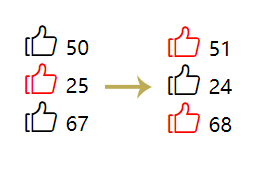

## 测试题（实操）

完成以下练习题，示例如下：

<div align=center>
    
    <div>点赞测试题</div>
</div>


初始代码如下：

```html
<!DOCTYPE html>
<html lang="en">
<head>
  <meta charset="UTF-8">
  <meta http-equiv="X-UA-Compatible" content="IE=edge">
  <meta name="viewport" content="width=device-width, initial-scale=1.0">
  <title>Document</title>
  <style>
    *{margin: 0; padding: 0;}
    li{ list-style: none;}
    .wrapper{ width: 200px; margin: 30px auto;}
    .wrapper i{ font-size: 30px}
    .wrapper i.active{ color: red}
  </style>
  <link rel="stylesheet" href="./img/iconfont.css">
  <script src="../react.development.js"></script>
  <script src="../react-dom.development.js"></script>
  <script src="../babel.min.js"></script>
  <script src="../lodash.min.js"></script>
</head>
<body>
  <div id="app"></div>
  <script type="text/babel">
    let app = document.querySelector('#app');
    let root = ReactDOM.createRoot(app);
    let { useState } = React;
    let Welcome = () => {
      const [list, setList] = useState([
        {id: 1, num: 50, checked: false},
        {id: 2, num: 25, checked: true},
        {id: 3, num: 67, checked: false}
      ])
      return (
        <ul className="wrapper">
          {
            list.map((v)=> <li key={v.id}><Like /></li>)
          }
        </ul>
      )
    }
    let Like = () => {
      
    }
    let element = (
      <Welcome />
    );
    root.render(element)
  </script>
</body>
</html>
```

要求如下：

1. 完成Like组件，包括点赞图标和点赞次数
2. 在图标没选中的情况下，点击图标添加active样式，点赞次数加一
3. 在图标选中的情况下，点击图标取消active样式，点赞次数减一

参考答案：

```html
<script type="text/babel">
    let app = document.querySelector('#app');
    let root = ReactDOM.createRoot(app);
    let { useState, useEffect } = React;
    let Welcome = () => {
      const [list, setList] = useState([
        {id: 1, num: 50, checked: false},
        {id: 2, num: 25, checked: true},
        {id: 3, num: 67, checked: false}
      ])
      const handleChange = (id) => {
        return () => {
          let cloneList = _.cloneDeep(list)
          let now = cloneList.find((v)=> v.id === id)
          now.num += now.checked ? -1 : 1;
          now.checked = !now.checked;
          setList(cloneList)
        }
      }
      return (
        <ul className="wrapper">
          {
            list.map((v)=> <li key={v.id}><Like {...v} handleChange={handleChange} /></li>)
          }
        </ul>
      )
    }
    let Like = (props)=>{
      const {id, num, checked, handleChange} = props
      const LikeClass = `iconfont icon-dianzan ${checked && 'active'}`
      return (
        <span>
          <i className={LikeClass} onClick={handleChange(id)}></i> { num }
        </span>
      );
    }
    let element = (
      <Welcome />
    );
    root.render(element)
</script>
```