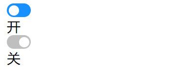

## 测试题（实操）

完成以下练习题，示例如下：

<div align=center>
    
    <div>Switch开关组件测试题</div>
</div>

初始代码如下：

```jsx
import { MySwitch } from './MyAntd'
import { useState } from 'react'
export default function App() {
  const [checked1, setChecked1] = useState(true)
  const [checked2, setChecked2] = useState(false)
  return (
    <div>
      <h2>hello MySwitch</h2>
      <MySwitch checked={checked1} onChange={setChecked1} /> { checked1 ? '开' : '关' }
      <MySwitch checked={checked2} onChange={setChecked2} /> { checked2 ? '开' : '关' }
    </div>
  )
}
```

要求如下：

1. 可以点击切换组件的状态
2. 切换时带有动画效果

参考答案：

```scss
// MySwtich.scss
.Switch {
  width: 28px;
  height: 16px;
  border-radius: 100px;
  background: #1890ff;
  cursor: pointer;
  &--closed {
    background: rgba(0, 0, 0, 0.25);
    .Switch__handle {
      left: 14px;
    }
  }
  &__handle {
    width: 12px;
    height: 12px;
    background: white;
    border-radius: 50%;
    position: relative;
    left: 2px;
    top: 2px;
    transition: .2s;
  }
}
```

```jsx
// MySwtich.jsx
import PropTypes from 'prop-types';
import classnames from 'classnames';
import './MySwitch.scss'
export default function MySwitch(props) {
  const switchClass = classnames({
    Switch: true,
    'Switch--closed': !props.checked
  })
  const handleClick = () => {
    props.onChange(!props.checked)
  }
  return (
    <div onClick={handleClick} className={switchClass}>
      <div className="Switch__handle"></div>
    </div>
  )
}
MySwitch.propTypes = {
  checked: PropTypes.bool,
  onChange: PropTypes.func
}
MySwitch.defaultProps = {
  checked: true,
  onChange: function(){}
}
```

