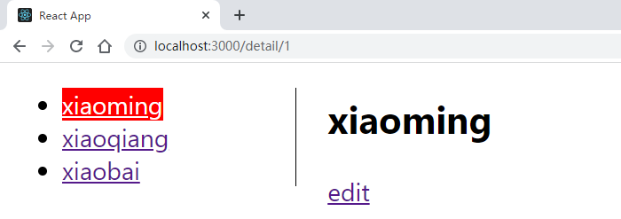
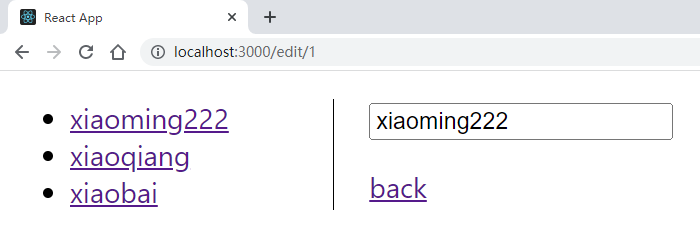
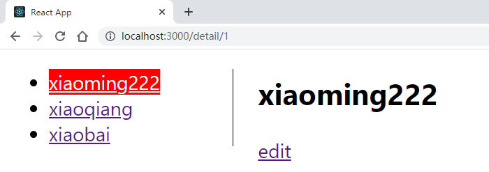

## 测试题（实操）

完成以下练习题，示例如下：

<div align=center>
    
    <div>步骤1</div>
</div>

<div align=center>
    
    <div>步骤2</div>
</div>

<div align=center>
    
    <div>步骤3</div>
</div>

要求如下：

1. 编写detail路由和edit路由
2. 给定初始数据/public/mock/users.json，完成异步请求，并同步到状态管理
2. 可以通过edit页面进行状态管理的修改，并返回detail页面

初始代码如下：

```json
//  /public/mock/users.json
[
  {
    "id": 1,
    "name": "xiaoming"
  },
  {
    "id": 2,
    "name": "xiaoqiang"
  },
  {
    "id": 3,
    "name": "xiaobai"
  }
]
```

参考答案：

```javascript
// /router/index.js
import { createBrowserRouter } from "react-router-dom";
import App from '../App'
import Detail from "../views/Detail/Detail";
import Edit from "../views/Edit/Edit";
import store from "../store";
import { usersList } from "../store/modules/users";
import { Navigate } from "react-router-dom";
import _ from 'lodash'
const routes = [
  {
    path: '/',
    element: <App />,
    children: [
      {
        index: true,
        element: <Navigate to="/detail/1" />
      },
      {
        path: 'detail/:id',
        element: <Detail />,
        loader: async() => {
          if( _.isEmpty(store.getState().users.list) ){
            await store.dispatch(usersList())
          }
        }
      },
      {
        path: 'edit/:id',
        element: <Edit />,
        loader: async() => {
          if( _.isEmpty(store.getState().users.list) ){
            await store.dispatch(usersList())
          }
        }
      }
    ]
  }
];
const router = createBrowserRouter(routes)
export default router;
```

```javascript
// /store/modules/users.js
import { createSlice, createAsyncThunk } from "@reduxjs/toolkit";
import axios from "axios";
const initialState = {
  list: []
}
export const usersList = createAsyncThunk('users/list', async ()=>{
  const ret = await axios.get('/mock/users.json')
  return ret.data;
})
const usersSlice = createSlice({
  name: 'users',
  initialState,
  reducers: {
    change(state, action){
      let ret = state.list.find((v)=> v.id === action.payload.id)
      ret.name = action.payload.name
    }
  },
  extraReducers: {
    [usersList.fulfilled]: (state, action)=>{
      state.list = action.payload
    }
  }
})
export default usersSlice.reducer
```

```javascript
// /store/index.js
import { configureStore } from "@reduxjs/toolkit";
import usersReducer from "./modules/users";
const store = configureStore({
  reducer: {
    users: usersReducer
  }
})
export default store;
```

```jsx
// /views/Detail/Detail.jsx
import React from 'react'
import './Detail.scss'
import { useSelector } from 'react-redux'
import { useParams, Link } from 'react-router-dom'
export default function Detail() {
  const list = useSelector((state)=> state.users.list)
  const params = useParams()
  const detail = list.find((v)=> v.id === Number(params.id))
  return (
    <div style={{ marginLeft: '20px'}}>
      <h2>{detail.name}</h2>
      <Link to={'/edit/'+detail.id}>edit</Link>
    </div>
  )
}
```

```jsx
// /views/Edit/Edit.jsx
import React from 'react'
import './Edit.scss'
import { useSelector, useDispatch } from 'react-redux'
import { useParams, Link } from 'react-router-dom'
export default function Edit() {
  const list = useSelector((state)=> state.users.list)
  const params = useParams()
  const detail = list.find((v)=> v.id === Number(params.id))
  const dispatch = useDispatch()
  const handleChange = (ev) => {
    dispatch({
      type: 'users/change',
      payload: {
        id: detail.id,
        name: ev.target.value
      }
    })
  }
  return (
    <div style={{ marginLeft: '20px'}}>
      <p><input type="text" value={detail.name} onChange={handleChange} /></p>
      <p><Link to={'/detail/'+detail.id}>back</Link></p>
    </div>
  )
}
```

```jsx
// App.jsx
import { NavLink, Outlet } from 'react-router-dom'
import { useSelector } from 'react-redux'
import './App.css'
function App() {
  const list = useSelector((state)=> state.users.list)
  return (
    <div className="App">
      <ul style={{borderRight: '1px black solid', width: '150px'}}>
        {
          list.map((v)=>{
            return <li key={v.id}><NavLink to={'/detail/'+v.id}>{v.name}</NavLink></li>
          })
        }
      </ul>
      <Outlet />
    </div>
  );
}
export default App;
```

