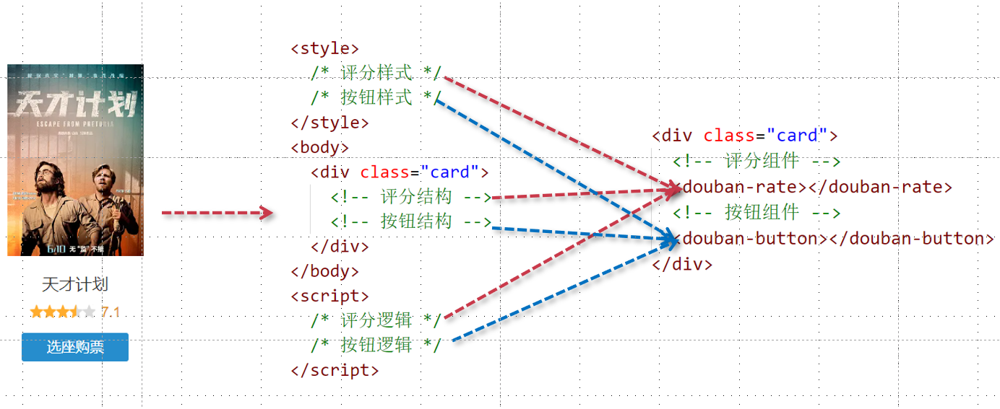

# 组件的概念及组件的基本使用方式

## 组件的概念

组件是带有名称的可复用实例，通常一个应用会以一棵嵌套的组件树的形式来组织，比如：页头、侧边栏、内容区等组件。

<div align=center>
    
    <div>vue组件</div>
</div>

组件可以拥有自己独立的结构，样式，逻辑。这样对于后期的维护是非常方便的。下面给出评分组件与按钮组件的抽离过程。

<div align=center>
    
    <div>组件的划分</div>
</div>

## 组件的命名方式与规范

- 定义组件可通过驼峰、短线两种风格定义
- 调用组件推荐短线方式

```vue
<div id="app">
    <my-head></my-head>
</div>
<script>
let app = Vue.createApp({
    data(){
        return {
        }
    }
})
app.component('my-head', {
    template: `
    <header>
        <div>{{ message }}</div>
        <h2>logo</h2>
        <ul>
            <li>首页</li>
            <li>视频</li>
            <li>音乐</li>
        </ul>
    </header>`,
    data(){
    	return {
        	message: 'hello world'
        }
    }
});
let vm = app.mount('#app');
</script>
```

## 根组件

app容器可以看成根组件，所以根组件跟普通组件都具备相同的配置信息，例如：data、computed、methods等等选项。

```vue
<div id="app">
	<my-head></my-head>
</div>
<script>
    // 根组件
    let RootApp = {
      data(){
        return {
        }
      }
    };
    // MyHead组件
    let MyHead = {
      template: `
        <header>
          <div>{{ message }}</div>
          <h2>logo</h2>
          <ul>
            <li>首页</li>
            <li>视频</li>
            <li>音乐</li>
          </ul>
        </header>
      `
    };
    let app = Vue.createApp(RootApp)
    app.component('MyHead', MyHead);
    let vm = app.mount('#app');
  </script>
```

根组件与MyHead组件形成了父子组件。

## 局部组件与全局组件

局部组件只能在指定的组件内进行使用，而全局组件可以在容器app下的任意位置进行使用。

