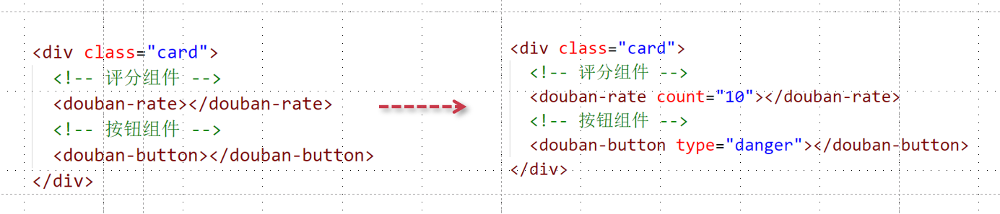

# 组件之间是如何进行互相通信的

上一个小节中，我们了解了组件是可以组合的，那么就形成了父子组件，父子组件之间是可以进行通信的， 那么为什么要通信呢？主要是为了让组件满足不同的需求。

<div align=center>
    
    <div>组件之间差异化</div>
</div>

## 父子通信

最常见的通信方式就是父传子，或者子传父，那么父传子通过props实现，而子传父则通过emits自定义事件实现。

<div align=center>
    
    <div>父子通信</div>
</div>


```vue
<div id="app">
    <my-head :count="count" @custom-click="handleClick"></my-head>
</div>
<script>
    let app = Vue.createApp({
        data(){
            return {
                count: 10
            }
        },
        methods: {
            handleClick(data){
              console.log(data);
            }
        }
    })
    app.component('MyHead', {
        props: ['count'],
        emits: ['custom-click'], 
        template: `
        <header>
          <div>{{ count }}</div>
          <h2>logo</h2>
          <ul>
            <li>首页</li>
            <li>视频</li>
            <li>音乐</li>
    	  </ul>
    	</header>`,
        mouted(){
        	this.$emit('custom-click', 'MyHead Data')
    	}
    });
    let vm = app.mount('#app');
</script>
```

## 父子通信需要注意的点

- 组件通信的props是可以定义类型的，在运行期间会进行检测
- 组件之间的数据是单向流动的，子组件不能直接修改传递过来的值
- 但是有时候也需要数据的双向流动，可利用v-model来实现

