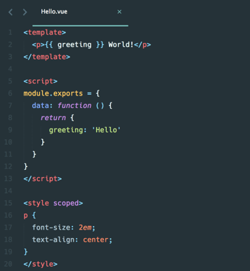

# 单文件组件SFC及Vue CLI脚手架的安装使用

Vue 单文件组件（又名 *.vue 文件，缩写为 SFC）是一种特殊的文件格式，它允许将 Vue 组件的模板、逻辑 与 样式封装在单个文件中。

## 为什么要使用 SFC

使用 SFC 必须使用构建工具，但作为回报带来了以下优点：

- 使用熟悉的 HTML、CSS 和 JavaScript 语法编写模块化的组件
- [让本来就强相关的关注点自然内聚](https://cn.vuejs.org/guide/scaling-up/sfc.html#what-about-separation-of-concerns)
- 预编译模板，避免运行时的编译开销
- [组件作用域的 CSS](https://cn.vuejs.org/api/sfc-css-features.html)
- [在使用组合式 API 时语法更简单](https://cn.vuejs.org/api/sfc-script-setup.html)
- 通过交叉分析模板和逻辑代码能进行更多编译时优化
- [更好的 IDE 支持](https://cn.vuejs.org/guide/scaling-up/tooling.html#ide-support)，提供自动补全和对模板中表达式的类型检查
- 开箱即用的模块热更新 (HMR) 支持

## 如何支持SFC

可通过项目脚手架来进行支持，Vue支持Vite脚手架和Vue CLI脚手架。这里我们先来介绍Vue CLI的基本使用方式。

```she
# 安装
npm install -g @vue/cli
# 创建项目
vue create vue-study
# 选择default
default (babel, eslint)
# 启动脚手架
npm run serve
```

通过localhost:8080进行访问。

## 脚手架文件的组成

- src/main.js -> 主入口模块
- src/App.vue -> 根组件
- src/components -> 组件集合
- src/assets -> 静态资源

## 单文件的代码组成

- template -> 编写结构
- script -> 编写逻辑
- style -> 编写样式

<div align=center>
    
    <div>单文件组件</div>
</div>

其中style中的scoped属性，可以让样式成为局部的，不会影响到其他组件，只会作用于当前组件生效，同时在脚手架下支持常见的文件进行模块化操作，例如：图片、样式、.vue文件等。
