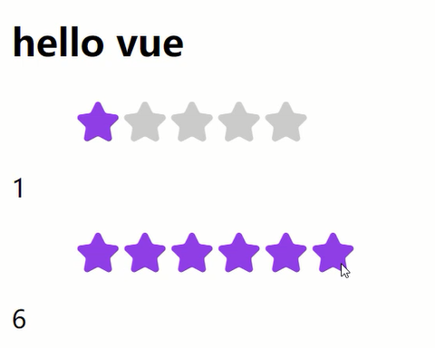

# 仿Element Plus的el-rate评分组件实现(单文件组件)


## 插件的安装

在完成本小节案例之前，先安装一下vsCode和chrome的相关插件。

- vsCode Plugin :  Vue Language Features (Volar)
- vsCode Plugin :  Vue VSCode Snippets
- Chrome Plugin:  Vue.js devtools

这些插件都有助于vue框架的使用。下面就看一下我们要做的案例吧。

前面我们仿Element Plus实现了一个按钮组件，不过没有在脚手架的环境下，本小节会在脚手架的环境下完成一个仿Element Plus的el-rate评分组件实现。仿造组件的地址：https://element-plus.org/zh-CN/component/rate.html

## 实现需求

- 最大分值
- 选中分值
- 事件交互

```vue
<template>
  <ul class="rate">
    <li v-for="index in max" :key="index" @mouseenter=" $emit('update:modelValue', index) " @mouseleave=" $emit('update:modelValue', initValue) " @click=" initValue = index "><i :class="rateClass(index)"></i></li>
  </ul>
</template>

<script>
import '@/assets/iconfont/iconfont.css'
  export default {
    data(){
      return {
        initValue: this.modelValue
      }
    },
    props: {
      max: {
        type: Number,
        default: 5
      },
      modelValue: {
        type: Number,
        default: 0
      }
    },
    emits: ['update:modelValue'],
    methods: {
      rateClass(index){
        return {
          iconfont: true,
          'icon-xingxing': true,
          active: this.modelValue >= index
        }
      }
    }
  }
</script>

<style scoped>
.rate{
  display: flex;
  list-style: none;
}
.rate i{
  font-size: 30px;
  color: #ccc;
}
.rate .active{
  color: blueviolet;
}
</style>
```

调用评分组件，如下：

```vue
<template>
  <h2>hello vue</h2>
  <el-rate v-model="value1"></el-rate>{{ value1 }}
  <el-rate :max="6" v-model="value2"></el-rate>{{ value2 }}
</template>

<script>
import ElRateVue from './components/ElRate.vue'
export default {
  name: 'App',
  data(){
    return {
      value1: 0,
      value2: 3
    }
  },
  components: {
    ElRate: ElRateVue
  }
}
</script>
```

<div align=center>
    
    <div>评分组件</div>
</div>

