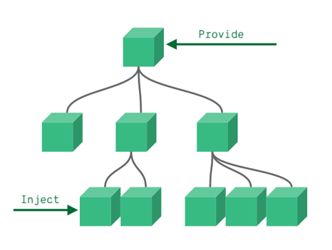

# 跨组件间通信方案 Provide_Inject

## 跨组件通信方案

正常情况下，我们的组件通信是需要一级一级的进行传递，通过父子通信的形式，那么如果有多层嵌套的情况下，从最外层把数据传递给最内层的组件就非常的不方便，需要一级一级的传递下来，那么如何才能方便的做到跨组件通信呢？

可以采用Provide 和 inject 依赖注入的方式来完成需求，代码如下：

<div align=center>
    
    <div>依赖注入</div>
</div>


```vue
// provide.vue
<script>
export default {
    provide(){
        return {
            message: 'hello provide',
            count: this.count,
            getInfo(data){
                console.log(data);
            }
        }
    }
}
</script>

// inject.vue
<template>
<div>
    hello inject, {{ message }}, {{ count }}
 </div>
</template>

<script>
export default {
    inject: ['message', 'getInfo', 'count'],
    mounted(){
        this.getInfo('hello inject');
    }
}
</script>
```

## Provide与Inject注意点

- 保证数据是单向流动的，从一个方向进行数据的修改
- 如果要传递响应式数据，需要把provide改造成工厂模式发送数据
