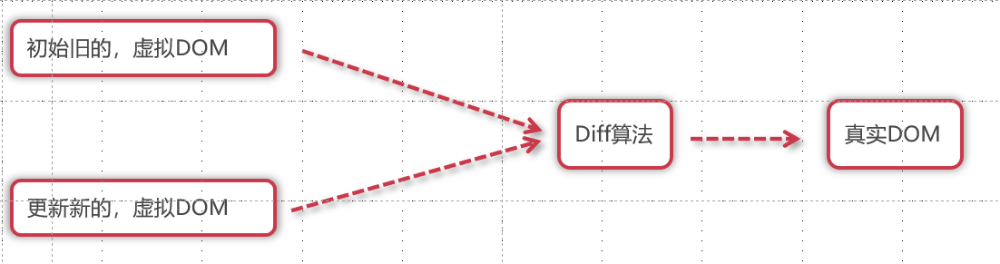

# 13-虚拟DOM与render函数及Diff算法

## 虚拟DOM

Vue框架帮我们完成了大量的DOM操作，那么在底层Vue并没有直接操作真实的DOM，因为真实的DOM直接去操作是非常好性能的，所以最好在JS环境下进行操作，然后在一次性进行真实DOM的操作。

```js
const vnode = {
  type: 'div',
  props: {
    id: 'hello'
  },
  children: [
    /* 更多 vnode */
  ]
}
```

那么在Vue中是如何把`<template>`模板中的字符串编译成虚拟DOM的呢？需要用到内置的render函数，这个函数可以把字符串转换成虚拟DOM。

<div align=center>
    
    <div>虚拟DOM</div>
</div>

## Diff算法

当更新的时候，一个依赖发生变化后，副作用会重新运行，这时候会创建一个更新后的虚拟 DOM 树。运行时渲染器遍历这棵新树，将它与旧树进行比较，然后将必要的更新应用到真实 DOM 上去。

而两个虚拟DOM进行对比的时候，需要加入一些算法提高对比的速度，这个就是Diff算法。

<div align=center>
    
    <div>Diff算法</div>
</div>

在脚手架下我们推荐使用<template>来完成结构的编写，那么也可以直接通过render函数进行虚拟DOM的创建，代码如下：

```vue
<!-- <template>
  <div>
    <h2>render</h2>
  </div>
</template> -->
<script>
  import { h } from 'vue';
  export default {
    render(){
      return h('div', h('h2', 'render2'))
    }  
  }
</script>

<style scoped>

</style>
```


