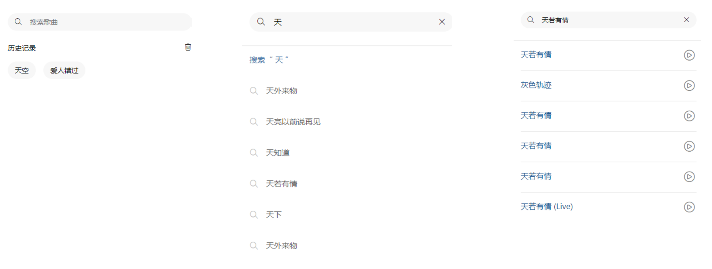
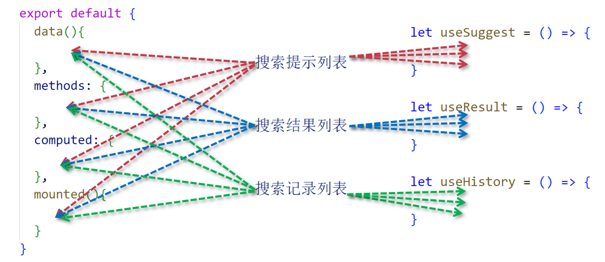

# 章节介绍

小伙伴大家好，本章将学习Vue3组合式API详解 - 大型应用的高端写法。

## 本章学习目标

本章将学习Vue3组合式API（即：Composition API），组合式API是Vue3组织代码的一种新型写法，有别于选项式的API。学会使用这种风格进行编程，并应用在项目之中。

## 什么是组合式API

前面说了组合式API是有别于选项式API的另一种新型写法，它更适合编写复杂的应用，假如我们要完成一个搜索功能，可能会有如下功能需要实现：

- 搜索提示列表
- 搜索结果列表
- 搜索记录列表

    
    
搜索案例

那么分别通过选项式和组合式是如何组织和实现代码的呢？可以发现选项式组织代码的时候，代码的跳跃性特别的强，对于后期维护特别的不方便；而组合式则是把相同功能的代码放到一起，功能独立，易于维护。

    
    
选项式VS组合式

## 课程安排

- 02-setup方法与script_setup及ref响应式
- 03-事件方法_计算属性_reactive_toRefs
- 04-生命周期_watch_watchEffect
- 05-跨组件通信方案provide_inject
- 06-复用组件功能之use函数
- 07-利用defineProps与defineEmits进行组件通信
- 08-利用组合式API开发复杂的搜索功能
- 09-利用组合式API开发搜索提示列表
- 10-利用组合式API开发搜索结果列表
- 11-利用组合式API开发搜索历史列表

