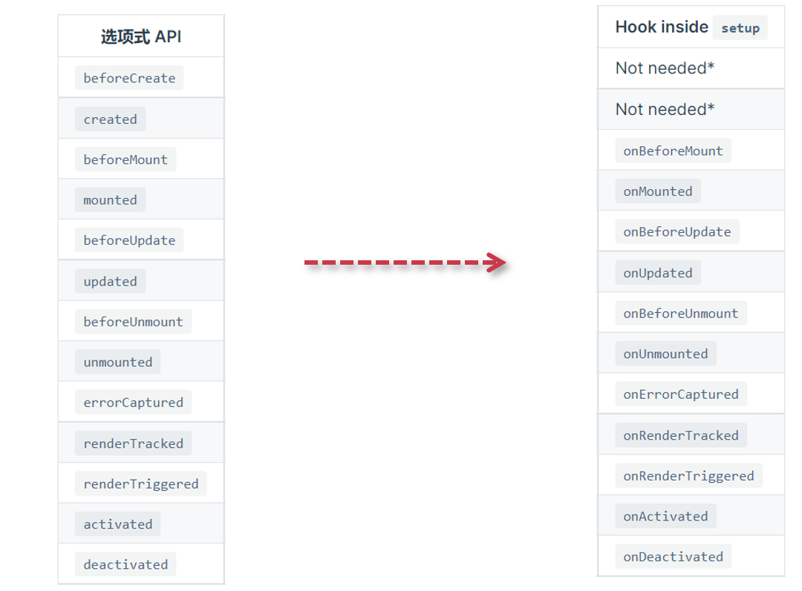

# 生命周期_watch_watchEffect

## 生命周期钩子函数

在学习选项式API的时候，我们学习了生命周期钩子函数，那么在组合式API中生命周期又是如何使用的呢？下面我们从图中先看一下对比的情况吧。

<div align=center>
    
    <div>生命周期对比</div>
</div>
那么具体的区别如下：

- 组合式中是没有beforeCreate和created这两个生命周期，因为本身在组合式中默认就在created当中，直接定义完响应式数据后就可以直接拿到响应式数据，所以不需要再有beforeCreate和created这两个钩子
- 组合式的钩子前面会有一个on，类似于事件的特性，那就是可以多次重复调用

```vue
<script>
import { onMounted, ref } from 'vue';
let count = ref(0);
onMounted(()=>{
  console.log( count.value );
});
onMounted(()=>{
  console.log( count.value );
});
onMounted(()=>{
  console.log( count.value );
});
</script>
```

## watch与watchEffect

这里先说一下watchEffect的用法，为了根据响应式状态自动应用和重新应用副作用，我们可以使用 watchEffect 函数。它立即执行传入的一个函数，同时响应式追踪其依赖，并在其依赖变更时重新运行该函数。

watchEffect常见特性：

- 一开始会初始触发一次，然后所依赖的数据发生改变的时候，才会再次触发
- 触发的时机是数据响应后，DOM更新前，通过flush: 'post' 修改成DOM更新后进行触发
- 返回结果是一个stop方法，可以停止watchEffect的监听
- 提供一个形参，形参主要就是用于清除上一次的行为

```vue
<template>
  <div>
    <h2>watchEffect</h2>
    <div>{{ count }}</div>
  </div>
</template>

<script setup>
import { ref, watchEffect } from 'vue';
let count = ref(0);
// const stop = watchEffect(()=>{
//   console.log(count.value);
// }, {
//   flush: 'post'
// })

// setTimeout(()=>{
//   stop();
// }, 1000)

// setTimeout(()=>{
//   count.value += 1;
// }, 2000)

watchEffect((cb)=>{
  console.log(count.value);
  cb(()=>{
    //更新前触发和卸载前触发，目的：清除上一次的行为(停止上一次的ajax，清除上一次的定时器)
    console.log('before update');
  })
})

setTimeout(()=>{
  count.value += 1;
}, 2000)
</script>
```

再来看一下watch侦听器的使用方式，如下：

```vue
<script setup>
import { ref, watch } from 'vue';
let count = ref(0);
watch(count, (newVal, oldVal) => {
  console.log(newVal, oldVal);
})
setTimeout(()=>{
  count.value = 1;
}, 2000)
</script>
```

那么watch与watchEffect的区别是什么呢？

- 懒执行副作用
- 更具体地说明什么状态应该触发侦听器重新运行
- 访问侦听状态变化前后的值
