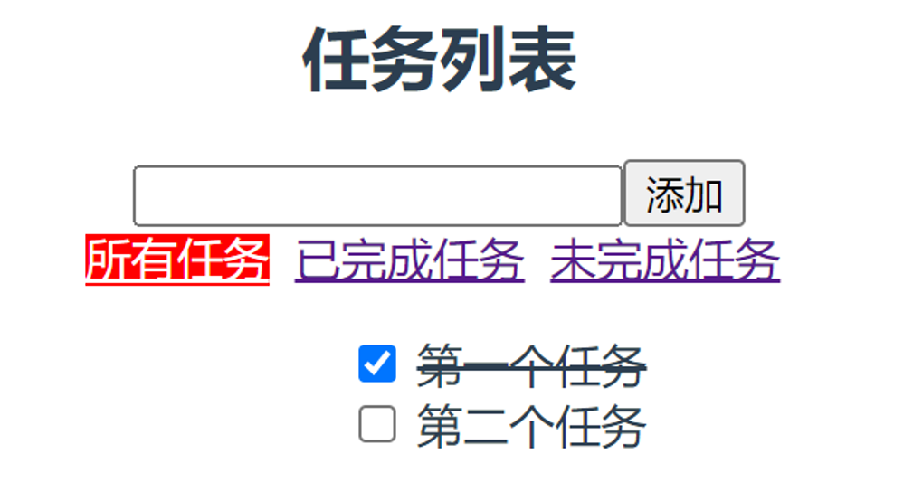

# Router_Vuex的任务列表综合案例

本小节将对本章学习的路由加状态管理做一个综合案例，通过案例来巩固本章所学知识点。

<div align=center>
    
    <div>综合案例</div>
</div>

首先先来配置案例中的路由，主要有三个页面，分别对应所有任务，已完成任务，未完成任务。

```js
import { createRouter, createWebHistory } from 'vue-router'
import Todo from '@/views/Todo.vue'
import Complete from '@/views/Complete.vue'
import Incomplete from '@/views/Incomplete.vue'
const routes = [
  {
    path: '/',
    redirect: '/todo'
  },
  {
    path: '/todo',
    component: Todo
  },
  {
    path: '/complete',
    component: Complete
  },
  {
    path: '/incomplete',
    component: Incomplete,
  }
];
const router = createRouter({
  history: createWebHistory(),
  routes
})
export default router;
```

在来配置一下Vuex状态管理，主要对任务列表进行共享状态处理：

```js
import { createStore } from "vuex";
const store = createStore({
  state: {
    todoList: [
      {
        isChecked: true, id: 1, task: '第一个任务'
      },
      {
        isChecked: false, id: 2, task: '第二个任务'
      }
    ]
  },
  actions: {
    
  },
  mutations: {
    add(state, payload){
      state.todoList.unshift({ isChecked: false, id: state.todoList.length, task: payload });
    }
  },
  getters: {
    complete(state){
      return state.todoList.filter((v)=> v.isChecked)
    },
    incomplete(state){
      return state.todoList.filter((v)=> !v.isChecked)
    }
  }
});
export default store;
```

最后看一下三个页面的基本逻辑处理：

```vue
<!-- Todo.vue -->
<template>
  <div>
    <ul>
      <li v-for="item in todoList" :key="item.id" :class="{ through: item.isChecked }">
        <input type="checkbox" v-model="item.isChecked"> {{ item.task }}
      </li>
    </ul>
  </div>
</template>
<script setup>
import { computed, defineComponent } from 'vue';
import { useStore } from 'vuex';
defineComponent({
  name: 'TodoView'
});
const store = useStore();
const todoList = computed(()=> store.state.todoList)
</script>
<!-- Complete.vue -->
<template>
  <div>
    <ul>
      <li v-for="item in todoList" :key="item.id" :class="{ through: item.isChecked }">
        <input type="checkbox" v-model="item.isChecked"> {{ item.task }}
      </li>
    </ul>
  </div>
</template>
<script setup>
import { computed, defineComponent } from 'vue';
import { useStore } from 'vuex';
defineComponent({
  name: 'CompleteView'
});
const store = useStore();
const todoList = computed(()=> store.getters.complete)
</script>
<!-- Incomplete.vue -->
<template>
  <div>
    <ul>
      <li v-for="item in todoList" :key="item.id" :class="{ through: item.isChecked }">
        <input type="checkbox" v-model="item.isChecked"> {{ item.task }}
      </li>
    </ul>
  </div>
</template>
<script setup>
import { computed, defineComponent } from 'vue';
import { useStore } from 'vuex';
defineComponent({
  name: 'IncompleteView'
});
const store = useStore();
const todoList = computed(()=> store.getters.incomplete)
</script>
```

