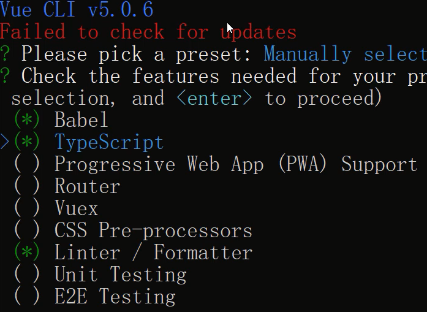

# Vue选项式API中如何使用TS

首先全新安装一下脚手架，在定义安装中，选择`TypeScript`选项。

<div align=center>
    
    <div>typescript安装</div>
</div>

## 选项式API使用TS

在选项式API中可以引入，`defineComponent`方法，这个方法可以对选项式API进行自动类型推断。并且需要在`<script>`标签上明确指定`lang="ts"`这个属性。

```vue
<script lang="ts">
import { defineComponent } from 'vue'
export default defineComponent({
  data(){
    return {
      count: 0
    }
  },
  mounted(){
    this.count = 2   // ✔
  }
});
</script>
```

在选项式API中可以利用类型断言的方式给响应式数据进行类型注解。

```vue
<script lang="ts">
import { defineComponent } from 'vue'
type Count = number | string;
interface List {
  username: string
  age: number
}
export default defineComponent({
  data(){
    return {
      count: 0 as Count,
      list: [] as List[]
    }
  }
});
</script>
```

像计算属性、方法等功能就可以正常配合TS的类型系统进行使用就好，如果是多个类型可以通过类型保护的方式进行控制，代码如下：

```vue
<script lang="ts">
import { defineComponent } from 'vue'
export default defineComponent({
  ...
  computed: {
    doubleCount(): number|string{
      if(typeof this.count === 'number'){
        return this.count * 2;
      }
      else{
        return this.count;
      }
    }
  },
  methods: {
    handleClick(n: number){
      if(typeof this.count === 'number'){
        this.count += n;
      }
    }
  }
});
</script>
```

