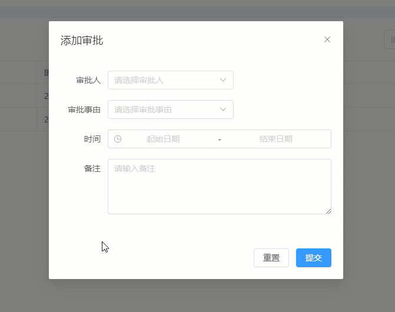

# 弹出框布局与初始数据渲染

## 对话框组件与日期选择器组件

弹出框布局，主要用到对话框组件，采用element plus中`<el-Dialog>`组件，地址：https://element-plus.gitee.io/zh-CN/component/dialog.html

除了对话框组件外，还会用到日期时间选择器组件`<el-date-picker>`组件，地址：https://element-plus.gitee.io/zh-CN/component/date-picker.html

```vue
// /src/views/Apply/Apply.vue
  <el-dialog
    v-model="dialogVisible"
    title="添加审批"
    width="500px"
    :before-close="handleClose"
  >
  <el-form
      ref="ruleFormRef"
      :model="ruleForm"
      :rules="rules"
      label-width="80px"
    >
      <el-form-item label="审批人" prop="approvername">
        <el-select v-model="ruleForm.approvername" placeholder="请选择审批人">
          <el-option v-for="item in approver" :key="(item._id as string)" :value="(item.name as string)" :label="(item.name as string)" />
        </el-select>
      </el-form-item>
      <el-form-item label="审批事由" prop="reason">
        <el-select v-model="ruleForm.reason" placeholder="请选择审批事由">
          <el-option value="年假" label="年假" />
          <el-option value="事假" label="事假" />
          <el-option value="病假" label="病假" />
          <el-option value="外出" label="外出" />
          <el-option value="补签卡" label="补签卡" />
        </el-select>
      </el-form-item>
      <el-form-item label="时间" prop="time">
        <el-date-picker
          v-model="ruleForm.time"
          type="datetimerange"
          start-placeholder="起始日期"
          end-placeholder="结束日期"
        />
      </el-form-item>
      <el-form-item label="备注" prop="note">
        <el-input
          v-model="ruleForm.note"
          :autosize="{ minRows: 4, maxRows: 6 }"
          type="textarea"
          placeholder="请输入备注"
        />
      </el-form-item>
    </el-form>
    <template #footer>
      <el-button @click="resetForm(ruleFormRef)">重置</el-button>
      <el-button
          type="primary"
          @click="submitForm(ruleFormRef)">提交</el-button>
    </template>
  </el-dialog>
```

最终效果

<div align=center>
    
    <div>弹出框布局</div>
</div>
