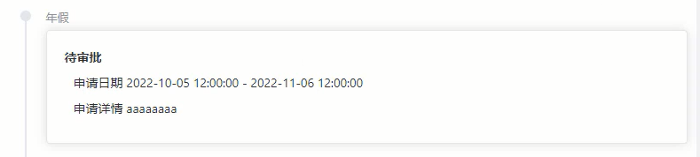

# 联动异常考勤页及数据处理

## 处理多条数据

本小节要联动异常考勤页，需要在独享守卫中进行多条数据的请求，所以需要做一些调整，采用 async/await写法更方便的处理异步操作。

```typescript
// /src/router/index.ts
	{
        path: 'exception',
        name: 'exception',
        component: Exception,
        meta: {
          menu: true,
          title: '异常考勤查询',
          icon: 'warning',
          auth: true,
        },
        async beforeEnter(to, from, next){
          const usersInfos = (store.state as StateAll).users.infos;
          const signsInfos = (store.state as StateAll).signs.infos;
          const checksApplyList = (store.state as StateAll).checks.applyList;
          const newsInfo = (store.state as StateAll).news.info;
          if( _.isEmpty(signsInfos) ){
            const res = await store.dispatch('signs/getTime', { userid: usersInfos._id })
            if(res.data.errcode === 0){
              store.commit('signs/updateInfos', res.data.infos)
            }
            else{
              return;
            }
          }
          if( _.isEmpty(checksApplyList) ){
            const res = await store.dispatch('checks/getApply', { applicantid: usersInfos._id })
            if(res.data.errcode === 0){
              store.commit('checks/updateApplyList', res.data.rets)
            }
            else{
              return;
            }
          }
          if( _.isEmpty(newsInfo) ){
            const res = await store.dispatch('news/getRemind', { userid: usersInfos._id })
            if(res.data.errcode === 0){
              store.commit('news/updateInfo', res.data.info)
            }
            else{
              return;
            }
          }
          next()
        }
      }
```

现在就可以继续去完成异常考勤页的开发，代码如下：

```vue
<template>   
   <el-col :span="12">
      <el-empty v-if="applyListMonth.length === 0" description="暂无申请审批" />
      <el-timeline v-else>
        <el-timeline-item v-for="item in applyListMonth" :key="(item._id as string)" :timestamp="(item.reason as string)" placement="top">
          <el-card>
            <h4>{{ item.state }}</h4>
            <p class="apply-info">申请日期 {{ (item.time as string[])[0] }} - {{ (item.time as string[])[1] }}</p>
            <p class="apply-info">申请详情 {{ item.note }}</p>
          </el-card>
        </el-timeline-item>
      </el-timeline>
    </el-col>
</template>
<script setup lang="ts">
const applyListMonth = computed(() => store.state.checks.applyList.filter((v) => {
  const startTime = (v.time as string[])[0].split(' ')[0].split('-');
  const endTime = (v.time as string[])[1].split(' ')[0].split('-');
  return startTime[1] <= toZero(month.value) && endTime[1] >= toZero(month.value)
}))
</script>    
```

最终效果

<div align=center>
    
    <div>异常考勤提醒</div>
</div>
