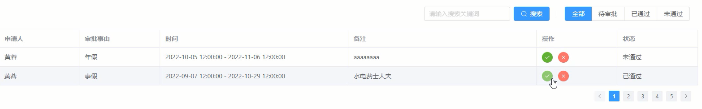

# 我的审批页功能实现与更新审批信息

首先先完成我的审批页筛选功能实现和分页的处理。

```vue
// /src/views/Check/Check.vue
<template>
  <el-table :data="pageCheckList" border>
  </el-table>
  <el-pagination small background layout="prev, pager, next" :total="checkList.length" :page-size="pageSize" @current-change="handleChange" />
</template>
<script setup lang="ts">
const defaultType = '全部'
const approverType = ref(defaultType)
const searchWord = ref('')
const pageSize = ref(2)
const pageCurrent = ref(1)
const checkList = computed(() => store.state.checks.checkList.filter((v)=> (v.state === approverType.value || defaultType === approverType.value) && (v.note as string).includes(searchWord.value)))
const pageCheckList = computed(()=> checkList.value.slice((pageCurrent.value - 1)*pageSize.value, pageCurrent.value*pageSize.value))
const handleChange = (value: number) => {
  pageCurrent.value = value;
}
</script>
```

然后完成表格组件中的操作的列表项功能。

```vue
// /src/views/Check/Check.vue
<template>
 	 <el-table-column label="操作" width="180">
        <template #default="scope">
          <el-button @click="handlePutApply(scope.row._id, '已通过', scope.row.applicantid)" type="success" icon="check" size="small" circle></el-button>
          <el-button @click="handlePutApply(scope.row._id, '未通过', scope.row.applicantid)" type="danger" icon="close" size="small" circle></el-button>
        </template>
      </el-table-column>
</template>
<script setup lang="ts">
const handlePutApply = (_id: string, state: '已通过' | '未通过', applicantid: string) => {
  store.dispatch('checks/putApply', {_id, state}).then((res)=>{
    if(res.data.errcode === 0){
      store.dispatch('checks/getApply', { approverid: usersInfos.value._id }).then((res)=>{
        if(res.data.errcode === 0){
          store.commit('checks/updateCheckList', res.data.rets)
        }
      })
      store.dispatch('news/putRemind', { userid: applicantid, applicant: true })
      ElMessage.success('审批成功')
    }
  })
}
</script>
```

最终效果

<div align=center>
    
    <div>我的审批页</div>
</div>

