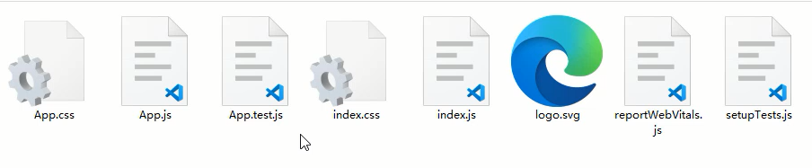

# 脚手架安装及vsCode插件安装

## 脚手架的安装

React的脚手架我们采用官方提供的Create React App进行搭建，Create React App是一个用于学习 React 的舒适环境，也是用 React 创建新的单页应用的最佳方式。

它会配置你的开发环境，以便使你能够使用最新的 JavaScript 特性，提供良好的开发体验，并为生产环境优化你的应用程序。你需要在你的机器上安装Node >= 14.0.0 和 npm >= 5.6。

```shell
# 安装命令
npx create-react-app my-app
cd my-app
npm start
```

目录结构如下：

<div align=center>
    
    <div>Create React App目录结构</div>
</div>

主要开发代码在src目录下。

<div align=center>
    
    <div>src开发环境下的文件</div>
</div>

App.js为根组件，index.js为入口模块，index.css为全局样式文件。

## 插件的安装

首先需要在vsCode下安装，`ES7+ React/Redux/React-Native snippets`这个插件，他可以帮我们快速创建React组件的初始代码，也可以给JSX做一些提示操作。直接在vsCode的扩展中进行搜索即可安装。

可通过`rcc`快速创建一个类组件，可通过`rfc`快速创建一个函数组件。

除了vsCode插件外，还需要安装一个Chrome插件，React Developer Tools 这个工具，可以对React组件进行查看，并且可观察到组件传递数据的情况。

课件中已经提供了相关工具，直接在Chrome下进行安装即可。

<div align=center>
    
    <div>React Developer Tools</div>
</div>

## 脚手架下需要注意的点

- 注意点：<></>
- 注意点：import React from 'react'
- 注意点：<React.StrictMode>
- 注意点：脚手架下的注释
- 注意点：package.json中的eslint

<></>是<React.Fragment>的简写，在脚手架下可以采用这种简写方式，提供一个唯一根节点非常的有用。

import React from 'react' 这句话在React17之前是不能省略的，但是在React17版本之后是可以省略的，因为React17版本之后对JSX语法的解析有了新的转换方式，具体可参考：https://zh-hans.reactjs.org/blog/2020/09/22/introducing-the-new-jsx-transform.html

<React.StrictMode>为严格模式，可以检测到一些比较过时的语法，还有一些在操作React的时候的一些不规范写法等。

在脚手架下添加注释，可通过快捷键进行操作，通过`alt + shift + a`键来完成，非常的方便。

package.json中默认对eslint进行了支持，可找到`eslintConfig`属性进行一些eslint的设置，例如：`rules`字段。

