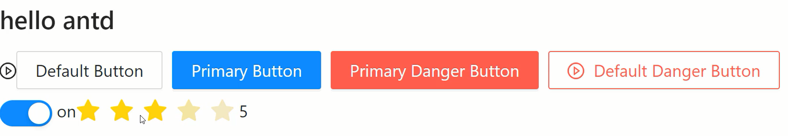

# Ant Design框架的安装与使用（一）

## 什么是Ant Design框架

Ant Design是React的第三方UI组件库，类似于前面我们学习的Vue中的Element Plus。Ant Design是阿里巴巴旗下蚂蚁金服推出的开源框架，分为PC端与移动端。

PC端：https://ant.design

移动端：https://mobile.ant.design

下面演示PC端的使用方式，需要先下载安装，本小节安装的是"antd": "^4.24.0"这个版本，如果后续升级了，大家可以通过@方式安装当前小节中指定的版本。

```shell
npm install antd@4.24.0
```

除了在主入口文件中引入antd框架外，还需要引入他提供的antd全局样式文件。

```js
// index.css
@import '~antd/dist/antd.css'
```

在antd中如果要使用图标的话，需要单独下载并使用。

```shell
npm install @ant-design/icons
```

antd中基本组件的使用方式如下，例如：Button按钮组件，Space间距组件，Switch开关组件，Rate评分组件等：

```jsx
import { Button, Space, Switch, Rate } from 'antd'
import { PlayCircleOutlined } from '@ant-design/icons'
import { useState } from 'react'
export default function App() {
    const [ checked, setChecked ] = useState(true)
    const [ value, setValue ] = useState(3)
    return (
        <div>
            <h2>hello antd</h2>
            <PlayCircleOutlined />
            <Space>
                <Button>Default Button</Button>
                <Button type="primary">Primary Button</Button>
                <Button type="primary" danger>Primary Danger Button</Button>
                <Button danger icon={<PlayCircleOutlined />}>Default Danger Button</Button>
            </Space>
            <div>
                <Switch checked={checked} onChange={setChecked} /> { checked ? 'on' : 'off' }
                <Rate value={value} onChange={setValue} /> { value }
            </div>
        </div>
    )
}
```

<div align=center>
    
    <div>antd基本组件</div>
</div>
