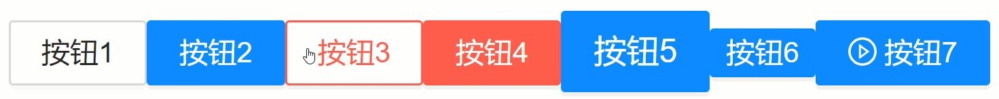

# 仿Ant Design的Button组件实现

前面小节我们已经对antd库有了了解，也学会了基本的使用。本小节要模拟实现一下antd中的Button组件，仿造实现的地址如下：https://ant.design/components/button-cn/。

首先在/src目录下创建一个新的目录，起名为/MyAntd，然后在这个文件夹下创建两个文件，即：/MyButton/MyButton.jsx 和 /MyButton/MyButton.scss。

接下来在/MyAntd下再创建一个index.js文件，作为所有组件的一个入口文件。

具体要实现组件的功能需求：

- 按钮类型
- 按钮尺寸
- 按钮文字
- 添加图标

```jsx
// /MyButton/MyButton.jsx

import React from 'react'
import './MyButton.scss'
import classnames from 'classnames'
import PropTypes from 'prop-types'
export default function MyButton(props) {
    const buttonClass = classnames({
        'my-button-default': true,
        [`my-button-${props.type}`]: true,
        [`my-button-${props.type}-danger`]: props.danger,
        [`my-button-${props.size}`]: true,
    })
    return (
        <button className={buttonClass}>{ props.icon } { props.children }</button>
    )
}
MyButton.propTypes = {
    type: PropTypes.string,
    size: PropTypes.string,
    danger: PropTypes.bool,
    icon: PropTypes.element
}
MyButton.defaultProps = {
    type: 'default',
    size: 'middle',
    danger: false
}
```

```scss
// /MyButton/MyButton.scss

.my-button{
    &-default{
        line-height: 1.5715;
        position: relative;
        display: inline-block;
        font-weight: 400;
        white-space: nowrap;
        text-align: center;
        background-image: none;
        border: 1px solid transparent;
        box-shadow: 0 2px 0 rgb(0 0 0 / 2%);
        cursor: pointer;
        transition: all 0.3s cubic-bezier(0.645, 0.045, 0.355, 1);
        -webkit-user-select: none;
        -moz-user-select: none;
        -ms-user-select: none;
        user-select: none;
        touch-action: manipulation;
        height: 32px;
        padding: 4px 15px;
        font-size: 14px;
        border-radius: 2px;
        color: rgba(0, 0, 0, 0.85);
        border-color: #d9d9d9;
        background: #fff;
        &-danger{
            color: #ff4d4f;
            border-color: #ff4d4f;
            background: #fff;
            box-shadow: 0 2px 0 rgb(0 0 0 / 5%);
        }
    }
    &-primary{
        color: #fff;
        border-color: #1890ff;
        background: #1890ff;
        box-shadow: 0 2px 0 rgb(0 0 0 / 5%);
        &-danger{
            color: #fff;
            border-color: #ff4d4f;
            background: #ff4d4f;
            box-shadow: 0 2px 0 rgb(0 0 0 / 5%);
        }
    }
    &-large{
        height: 40px;
        padding: 6.4px 15px;
        font-size: 16px;
        border-radius: 2px;
    }
    &-small{
        height: 24px;
        padding: 0 7px;
        font-size: 14px;
        border-radius: 2px
    }
}
```

开发好组件后，就去测试一下按钮组件的各种功能。

```jsx
import React from 'react'
import { MyButton } from './MyAntd'
import { PlayCircleOutlined } from '@ant-design/icons'
export default function App() {
    return (
        <div>
            <h2>hello myAntd</h2>
            <MyButton>按钮1</MyButton>
            <MyButton type="primary">按钮2</MyButton>
            <MyButton danger>按钮3</MyButton>
            <MyButton type="primary" danger>按钮4</MyButton>
            <MyButton type="primary" size="large">按钮5</MyButton>
            <MyButton type="primary" size="small">按钮6</MyButton>
            <MyButton type="primary" icon={<PlayCircleOutlined />}>按钮7</MyButton>
        </div>
    )
}
```

<div align=center>
    
    <div>仿antd按钮组件</div>
</div>

