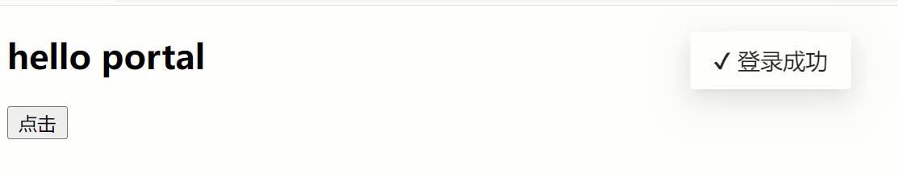

# createPortal传送门与逻辑组件的实现

## createPortal传送门

传送门就是把当前容器内的结构传递到容器外，主要是为了解决一些布局上的问题。在React中通过ReactDOM.createPortal()将子节点渲染到已 DOM 节点中的方式，从而实现传送门功能。

```jsx
import React, { useState } from 'react'
import ReactDOM from 'react-dom'
function Message() {
    return ReactDOM.createPortal( <div>hello Message</div>, document.body )
}
export default function App() {
    const [ show, setShow ] = useState(false)
    const handleClick = () => {
        setShow(true)
    }
    return (
        <div>
            <h2>hello portal</h2>
            <button onClick={handleClick}>点击</button>
            { show && <Message /> }
        </div>
    )
}
```

上面的案例中，是非常典型的弹出消息框，需要相对于body进行偏移，所以需要把这个弹出消息框从当前容器中传输到body下。

但是这种弹出框一般在组件中都会通过逻辑组件进行实现，并不会直接去编写结构，那么该如何实现一个逻辑组件呢？

```jsx
import { useRef, useState } from 'react'
import ReactDOM from 'react-dom/client';
import './05_portal.scss'
import { CSSTransition } from 'react-transition-group'
const message = {
    success(text){
        const message = ReactDOM.createRoot(document.querySelector('#message'))
        message.render(<Message text={text} icon="✔" />)
    }
}
function Message(props) {
    const [prop, setProp] = useState(true)
    const nodeRef = useRef(null)
    const handleEntered = () => {
        setTimeout(()=>{
            setProp(false)
        }, 2000)
    }
    return (
        <CSSTransition appear nodeRef={nodeRef} in={prop} timeout={1000} classNames="Message" unmountOnExit onEntered={handleEntered}>
            <div className="Message" ref={nodeRef}>{props.icon} {props.text}</div>
        </CSSTransition>
    )
}
export default function App() {
    const handleClick = () => {
        message.success('登录成功');
    }
    return (
        <div>
            <h2>hello portal</h2>
            <button onClick={handleClick}>点击</button>
        </div>
    )
}
```

附带逻辑组件加动画效果，还有对应的CSS样式。

```scss
// 05_portal.scss

.Message{
    display: inline-block;
    padding: 10px 16px;
    background: #fff;
    border-radius: 2px;
    box-shadow: 0 3px 6px -4px #0000001f, 0 6px 16px #00000014, 0 9px 28px 8px #0000000d;
    pointer-events: all;
    position: absolute;
    top: 20px;
    left: 50%;
    transform: translateX(-50%);
}
.Message-enter{
    opacity: 0;
    top: 10px;
}
.Message-enter-active{
    opacity: 1;
    top: 20px;
    transition: 1s;
}
.Message-enter-done{
    opacity: 1;
    top: 20px;
}
.Message-exit{
    opacity: 1;
    top: 20px;
}
.Message-exit-active{
    opacity: 0;
    top: 10px;
    transition: 1s;
}
.Message-exit-done{
    opacity: 0;
    top: 10px;
}
.Message-appear{
    opacity: 0;
    top: 10px;
}
.Message-appear-active{
    opacity: 1;
    top: 20px;
    transition: 1s;
}
.Message-appear-done{
    opacity: 1;
    top: 20px;
}
```

<div align=center>
    
    <div>逻辑组件弹出提示框</div>
</div>
