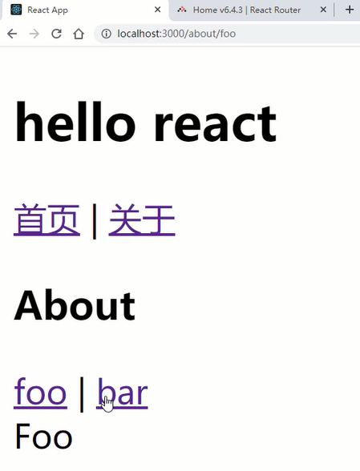

# ReactRouterV6.4 基础路由搭建

## 路由的安装

通过npm来安装react-router-dom模块。

```shell
# 安装命令
npm i react-router-dom
```

安装好的版本为：`"react-router-dom": "^6.4.3"`。

接下来在脚手架的/src目录下，创建一个/router文件夹和一个/router/index.js文件，这个index.js文件就是路由的配置文件。

那么React中的路由模式跟Vue中的路由模式是一样的，分为：history模式(HTML5模式)和hash模式两种。

- history模式：createBrowserRouter
- hash模式：createHashRouter

```javascript
import { createBrowserRouter, createHashRouter } from 'react-router-dom'
//路由表
export const routes = [];
//路由对象
const router = createBrowserRouter(routes);
export default router;
```

接下来让路由配置文件与React结合，需要在主入口index.js进行操作，如下：

```javascript
import { RouterProvider } from 'react-router-dom'
import router from './router';
const root = ReactDOM.createRoot(document.getElementById('root'));
root.render(
  <React.StrictMode>
    <RouterProvider router={router}></RouterProvider>
  </React.StrictMode>
);
```

路由表的配置字段如下：

- path：指定路径
- element：对应组件
- children：嵌套路由

```javascript
//路由表
export const routes = [
    {
        path: '/',
        element: <App />,
        children: [
            {
                path: '',
                element: <Home />
            },
    		{
                path: 'about',
                element: <About />,
                children: [
                    {
                        path: 'foo',
                        element: <Foo />,
                    },
                    {
                        path: 'bar',
                        element: <Bar />,
                    }
    			]
    		}
        ]
    }
];
```

接下来就是显示路由区域，利用<outlet>组件

```jsx
import React from "react";
import { Outlet, Link } from 'react-router-dom'
function App() {
  return (
    <div className="App">
      <h2>hello react</h2>
      <Link to="/">首页</Link> | <Link to="/about">关于</Link>
      <Outlet />
    </div>
  );
}
export default App;
```

可以看到 <Link>组件用于声明式路由切换使用。同样<outlet>组件也可以给嵌套路由页面进行使用，从而完成二级路由的切换操作。

```jsx
import React from 'react'
import './About.scss'
import { Outlet, Link } from 'react-router-dom'
export default function About() {
  return (
    <div>
      <h3>About</h3>
      <Link to="/about/foo">foo</Link> | <Link to="/about/bar">bar</Link>
      <Outlet />
    </div>
  )
}
```

<div align=center>
    
    <div>react路由基本搭建</div>
</div>
