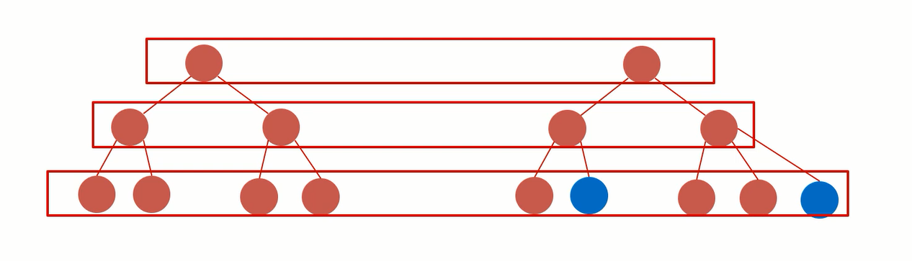
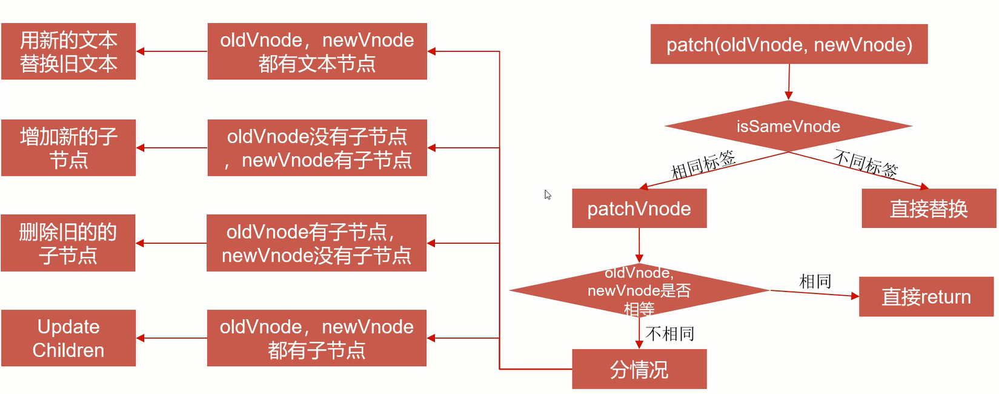
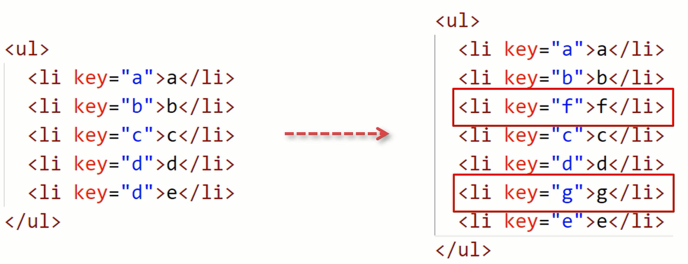
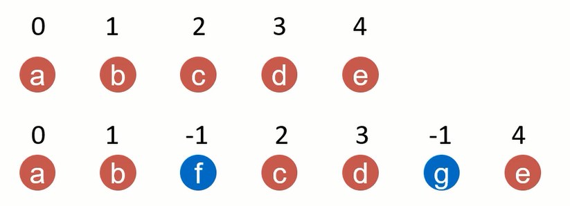
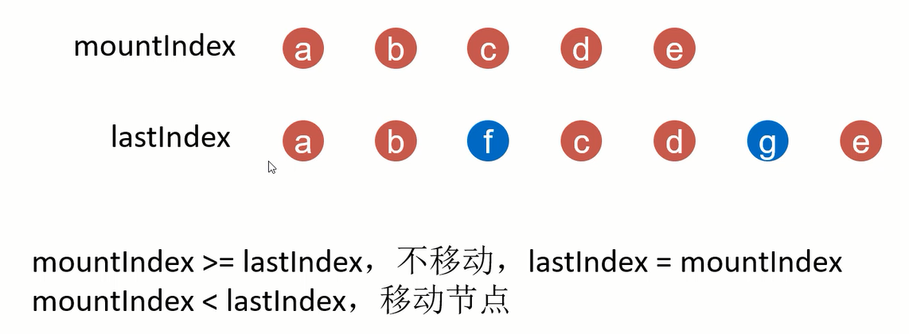

# React18与Vue3对比之diff算法的相同策略与不同策略

## diff算法的相同策略

首先两个框架都是采用了同层级对比的方式，这样可以大大减少对比的次数。

    
    
diff算法同层级对比

当两个节点进行对比的时候，要分不同的情况进行处理。

    
    
diff算法对比情况

大部分的策略都是一样的，只有当两个字节都存在子节点的时候，对比方案才有所区别。

## diff算法的不同策略

下面是一个具体的案例，来分别看一下Vue和React是如何进行处理的。

    
    
子节点不同的案例

下面先看一下Vue的策略，即数组格式，首尾对比，最长递增子序列。

    
    
Vue的diff策略

再看一下React的策略，即r链表格式，从左到右，索引比较。

    
    
React的diff策略

