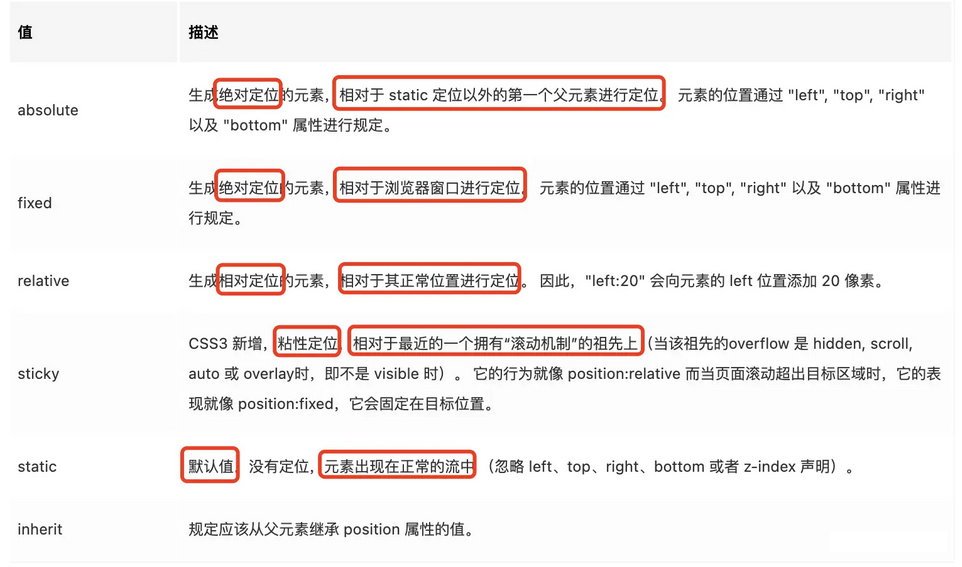

# CSS篇

### 盒模型

- 标准盒模型

  - 盒子总宽度: width + padding + border + margin;

  - 盒子总高度: height + padding + border + margin;

    > 总结: width/height 只是内容宽高, 不包含padding和border

- IE怪异盒子模型

  - 盒子总宽度: width + margin;

  - 盒子总高度: height + margin;

    > 总结: width/height包含了padding和border

- 更改盒模型

  > box-sizing: border-box;

### CSS的display属性有哪些?

- inline(默认)
- block
- inline-block
- flex
- grid
- table
- list-item
- 双值的: 只有Firefox70支持了这一语法

### position



### flex里面的属性

#### 容器的属性

- flex-direction

  - 决定**主轴的方向**（即项目的排列方向）
  - `row`（**默认值**）：主轴为水平方向，起点在左端。
  - `row-reverse`：主轴为水平方向，起点在右端。
  - `column`：主轴为垂直方向，起点在上沿。
  - `column-reverse`：主轴为垂直方向，起点在下沿。

- flex-wrap

  - `flex-wrap`属性定义，如果一条轴线排不下，如何换行
  - `nowrap`:(**默认**）：不换行。
  - `wrap`:换行，第一行在上方。
  - `wrap-reverse`:换行，第一行在下方

- flex-flow

  - `flex-flow`属性是`flex-direction`属性和`flex-wrap`属性的**简写形式**，默认值为`row nowrap`。

- justify-content

  - `justify-content`属性定义了项目在主轴上的对齐方式。

  - `-flex-start`（**默认值**）：左对齐

  - `flex-end`：右对齐

  - `center`： 居中

  - `space-between`：**两端对齐**，项目之间的间隔都相等。

  - `space-around`：每个项目两侧的间隔相等。所以，**项目之间的间隔比项目与边框的间隔大一倍**。

  

- align-items

  - `align-items`属性定义项目在交叉轴上如何对齐。

  - `stretch`（**默认值**）：如果*项目*未设置高度或设为`auto`，将**占满整个容器的高度**。

  - `flex-start`：交叉轴的起点对齐。

  - `flex-end`：交叉轴的终点对齐。

  - `center`：交叉轴的中点对齐。

  - `baseline`: 项目的第一行文字的基线对齐。

- align-content

  - `align-content`属性定义了**多根轴线的对齐方式**。
  - 如果项目只有一根轴线，该属性不起作用。

#### 项目的属性

- order
  - `order`属性定义项目的排列顺序。
  - **数值越小，排列越靠前，默认为0**。
- flex-grow
  - `flex-grow`属性定义项目的**放大比例**
  - 默认为0，即如果存在剩余空间，也不放大
  - 如果*所有*项目的`flex-grow`属性都为1，则它们将等分剩余空间（如果有的话）
- flex-shrink
  - `flex-shrink`属性定义了项目的**缩小比例**，
  - 默认为1，即如果空间不足，该项目将缩小。
  - 如果所有项目的`flex-shrink`属性都为1，当空间不足时，都将**等比例缩小**
- flex-basis
  - `flex-basis`属性定义了在**分配多余空间之前**，项目占据的{主轴空间|main size}。
  - 浏览器根据这个属性，计算主轴是否有多余空间。
  - 它的默认值为auto，即项目的本来大小。
- flex
  - `flex`属性是`flex-grow`, `flex-shrink` 和 `flex-basis`的简写，**默认值为0 1 auto**。**后两个属性可选**。
  - **`flex: 1` = `flex: 1 1 0%`**
  - `flex: auto` = `flex: 1 1 auto`
- align-self

#### flex: 1 VS flex:auto

> flex: 1和flex:auto的区别, 归结于flex-basis: 0和flex-basis: auto的区别

- 当设置为0时（**绝对弹性元素**），此时相当于告诉`flex-grow`和`flex-shrink`在伸缩的时候不需要考虑我的尺寸

- 当设置为`auto`时（**相对弹性元素**），此时则需要在伸缩时将元素尺寸纳入考虑


# JavaScript篇

### 基本数据类型

#### 数据类型分类

- undefined
- null
- Boolean
- String
- Number
- Symbol(es6)
- BigInt(es2020)
- Object

#### 判断数据类型的方式

- typeof

- Objectprototype.toString.call(xx)

  - 判断基本数据类型
  - 实现原理
    - 若参数(xx)不为 `null` 或 `undefined`, 则将参数转为对象, 再作判断
    - 转为对象后, 取得该对象的 `[Symbol.toStringTag]` 属性值（可能会遍历原型链）作为 `tag`，然后返回 `"[object " + tag + "]"` 形式的字符串。

- instanceof

  - `a instanceof B`判断的是 `a` 和 `B` 是否有**血缘关系**，而不是仅仅根据是否是父子关系
  - 在ES6中 `instanceof` 操作符会使用 `Symbol.hasInstance` 函数来确定关系。

- constructor

  - 只要**创建一个函数**,就会按照特定的规则为这个函数创建一个 `prototype` 属性（指向原型对象）。

  - 默认情况下，所有原型对象**自动**获得一个名为 `constructor` 的属性，**指回与之关联的构造函数**。

  - 每次**调用构造函数创建一个新实例**，实例的内部`[[Prototype]]`指针就会被赋值为**构造函数的原型对象**。

  - **实例与构造函数原型之间有直接的联系,但实例与构造函数之间没有**

  - 通过**实例和构造函数原型对象**的关系，来判断是否实例类型。
  - `null/undefined`是一个**假值**，没有对应**包装对象**（无法进行装箱操作），也不是任何构造函数的实例。所以，不存在原型，即，无法使用 `constructor` 判断类型。

### ES6的新特性

- `const` 和 `let`
- 解构赋值
- 模板字符串
- 函数的扩展
  - 函数的默认值
  - `rest`参数
  - 箭头函数
- 数组的扩展
  - Array.from()将类数组转为数组
  - `find()`、`findIndex()`找出第一个符合条件的成员/下标
  - `entries()`、`keys()`、`values()` 用于遍历数组。（配合`for...of`)
  - `includes()` 是否存在指定无素(返回布尔值)
- 对象的扩展
  - 属性名可使用表达式
  - `Object.assign()`
  - `Object.keys()`, `Object.values()`, `Object.entries()`
- `Symbol`
- `Set`和`Map`
- `Promise`
- `Iterator`和`for ... of`
  - 为各种数据提供统一的，简便的访问接口
- `Generator`和`async await`

### 箭头函数和普通函数的区别

- 语法更加简洁、清晰

- 箭头函数**没有 `prototype` (原型)，所以箭头函数本身没有`this`**

- **箭头函数不会创建自己的`this`**
  - 箭头函数没有自己的`this`，箭头函数的`this`指向在定义的时候继承自**外层第一个普通函数的this**

- **`call` | `apply` | `bind` 无法改变箭头函数中`this`的指向**

- 箭头函数**不能作为构造函数使用**

- 箭头函数**不绑定`arguments`，取而代之用`rest`参数`...`代替`arguments`对象，来访问箭头函数的参数列表**

- 箭头函数不能用作`Generator`函数，不能使用`yield`关键字

### CommonJS和ES6 Module的区别

- `CommonJS` 是同步加载模块，`ES6`是异步加载模块
- `CommonJS` 模块输出的是一个值的拷贝，`ES6` 模块输出的是值的引用。

- `CommonJS` 模块是运行时加载，ES6 模块是编译时输出接口。

  >`CommonJS`不适用于浏览器环境

### 数组常用的方法

#### 改变原数组

- push
- pop
- shift
- unshift
- reverse
- sort
- splice

#### 不会改变

- concat
- join
- slice
- filter
- reduce
- find
- findIndex


# 浏览器篇            

### 浏览器的进程和线程

- 进程: 某个应用程序的执行程序
- 线程: 常驻在进程内部并负责该进程部分功能的执行程序

### 浏览器渲染过程

1、页面渲染起始标识

- 当垂直同步信号（VSync）被`排版线程`接收到，新的屏幕渲染开始

2、输入事件回调

- 输入事件的数据信息从`排版线程`向`主线程`的事件回调中传递。
- 所有输入事件的回调(`touchmove/scroll/click`)应该先被调用，并且每帧都应该触发，但是这不是必须的

3、`rAF`（`requestAnimationFrame`）

- 这是一个用于屏幕视觉更新的理想的位置。
- 因为，在此处能够获取到`垂直同步事件`最新的输入数据。

4、{解析HTML|Parse HTML}

- 通过**指定的解析器**，将不能被浏览器识别的**HTML文本**，转换为浏览器能识别的数据结构:DOM对象。

5、重新计算样式

- 对**新生成**或**被修改**的元素进行**样式信息计算**。
- 生成CSSOM
- 将**元素样式和DOM元素结合起来**，就会生成`Render Tree`

6、{布局|Layout}

- 计算每个可视元素的位置信息(距离视口的距离和元素本身大小)。
- 并生成对应的`Layout Tree`。

7、{更新图层树|Update Layer Tree}

- 在 `Render 树`的基础上，我们会将拥有相同z 坐标空间的 `Layout Objects`归属到同一个{渲染层|Paint Layer}中。

- ```
  Paint Layer
  ```

   最初是用来实现

  {层叠上下文|Stacking Context}

  - 它主要来保证⻚面元素以正确的顺序合成。

8、{绘制|Paint}：

- 该过程包含两个过程，

- 第一个过程是

  绘制操作

  (

  ```
  painting
  ```

  )

  - 该过程用于生成任何被**新生成**或者**改动元素**的绘制信息(包含图形信息和文本信息)；

- 第二个过程是

  栅格化

  (

  ```
  Rasterization
  ```

  ),

  - 用于执行上一个过程生成的绘制信息。

9、{页面合成|Composite}：

- 将图层信息(`layer`)和图块信息提交(`commit`)到**合成线程**(排版线程)中。并且在合成线程中会对一些额外的属性进行解释处理。
- 例如：某些元素被赋值`will-change`或者一些使用了硬件加速的绘制方式(`canvas`)。

10、{栅格化|Rasterize} ：

- 在绘制阶段(`Paint`)生成的绘制记录(`Paint Record`)被合成线程维护的{图块工作线程|Compositor Tile Worker}所消费。
- 栅格化是根据图层来完成的，而每个图层由多个图块组成。

11、页面信息提交：

- 当页面中所有的图层都被栅格化，并且所有的图块都被提交到{合成线程|Compositor}，此时{合成线程|Compositor}将这些信息连同输入数据(input data)一起打包，并发送到**GPU线程**。

12、页面显示：

- 当前页面的所有信息在`GPU`中被处理，`GPU`会将页面信息传入到**双缓存中的后缓存区**，以备下次**垂直同步信号**到达后，前后缓存区相互置换。然后，此时屏幕中就会显示想要显示的页面信息。

13、**requestIdleCallback**：如果在当前屏幕刷新过程中，主线程在处理完上述过程后还有**剩余时间**(<`16.6ms`)，此时主线程会主动触发`requestIdleCallback`。


### cookie和session的区别和联系

>  Session比Cookie安全, Session是存储在服务器端的, Cookie是存储在客户端的

1. cookie数据存放在客户端, session数据放在服务器上;
2. cookie不是很安全, 别人可以分析存放在本地的cookie并进行cookie欺骗;
   - 考虑到安全应当使用session
3. session会在一定时间内保存在服务器上,当访问增多, 会比较占用服务器的性能;
   - 考虑性能应当使用cookie
4. 不再浏览器对cookie的数据大小限制不同, 个数限制也不相同;
5. 可以考虑将登录等重要的信息存放在session, 不重要的信息可以放在cookie中.


### 实现跨域的解决方案

1. JSONP
2. CORS
3. http-proxy
4. nginx
5. websocket
6. 跨站脚本API访问，如：`postMessage`、`document.domain`等


